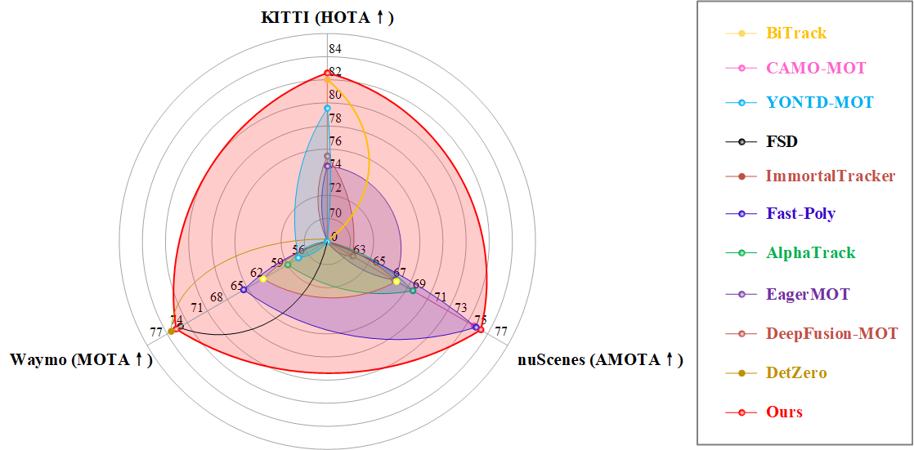

● 🎉 MCTrack项目部署成功！

  MCTrack 已经在您的 Windows 系统中成功部署完成。以下是部署的详细信息：

  部署位置： D:\OneDrive\NUS\ME5400\MCTrack\

  环境配置：
  - Conda 虚拟环境：MCTrack (Python 3.8)
  - 所有依赖包已安装完成

  如何使用：

  1. 激活环境：
  conda activate MCTrack
  2. 进入项目目录：
  cd D:\OneDrive\NUS\ME5400\MCTrack
  3. 运行 KITTI 数据集追踪（示例）：
  python main.py --dataset kitti -e -p 1

  注意事项：
  - 当前配置主要适用于 KITTI 和 nuScenes 数据集
  - 如需使用 KITTI 数据集，您需要先下载 KITTI 数据并按照 README 中的结构组织数据
  - 项目已经可以正常运行，出现的语法警告不影响功能


<div  align=center></div>

## <p align=center>MCTrack：一个面向自动驾驶的统一 3D 多目标跟踪框架</p> 


  <br>
  <div align="center">
  <a href='https://arxiv.org/abs/2409.16149'></a>
  </div>
  <br>

## 0. 摘要

本文介绍了 MCTrack，一种新的 3D 多目标跟踪方法，在 KITTI、nuScenes 和 Waymo 数据集上均取得了最新的 SOTA（state-of-the-art）性能。针对现有跟踪范式往往只在特定数据集上表现良好、泛化能力不足的问题，MCTrack 提供了统一的解决方案。此外，我们还标准化了不同数据集的感知结果格式，称为 BaseVersion，方便多目标跟踪（MOT）领域的研究者专注于核心算法开发，无需过多关注数据预处理。最后，针对现有评测指标的局限性，我们提出了一套新的评测指标，能够评估如速度、加速度等运动信息的输出，这对于下游任务至关重要。
<p align="center"></p>

## 1. 最新动态

- 2025-06-16. MCTrack 被 IROS 2025 录用。
- **[🔥🔥🔥2024-10-08]**. 代码已开源发布。🙌
- 2024-09-24. MCTrack 已在 [arXiv](https://arxiv.org/) 发布。
- 2024-09-01. 我们在 [Waymo](https://waymo.com/open/challenges/2020/3d-tracking/) 数据集 MOT 任务中排名第 **2**。
- 2024-08-30. 我们在 [KITTI](http://www.cvlibs.net/datasets/kitti/eval_tracking.php) 数据集 MOT 任务中排名第 **1**。
- 2024-08-27. 我们在 [nuScenes](https://www.nuscenes.org/tracking?externalData=all&mapData=all&modalities=Any) 数据集 MOT 任务中排名第 **1**。

## 2. 结果

### [KITTI](https://www.cvlibs.net/datasets/kitti/eval_tracking_detail.php?result=236cb88ca975231d7a3ed33556025e177d0eab20)

#### 在线

| **方法** | **检测器** | **数据集** | **HOTA** | **MOTA** | **TP** | **FP** | **IDSW** |
| --- | --- | --- | --- | --- | --- | --- | --- |
| **MCTrack** | VirConv | test | 81.07 | 89.81 | 32367 | 2025 | 46  |
| **MCTrack** | VirConv | train | 82.65 | 85.19 | 22186 | 1659 | 22  |

#### 离线

| **方法** | **检测器** | **数据集** | **HOTA** | **MOTA** | **TP** | **FP** | **IDSW** |
| --- | --- | --- | --- | --- | --- | --- | --- |
| **MCTrack** | VirConv | test | 82.75 | 91.79 | 32095 | 2297 | 11  |
| **MCTrack** | VirConv | train | 83.89 | 86.56 | 22150 | 1311 | 3  |

### [nuScenes](https://www.nuscenes.org/tracking?externalData=all&mapData=all&modalities=Any)

| 方法 | 检测器 | 数据集 | AMOTA | MOTA | TP  | FP  | IDS |
| --- | --- | --- | --- | --- | --- | --- | --- |
| **MCTrack** | LargeKernel3D | test | 0.763 | 0.634 | 103327 | 19643 | 242 |
| **MCTrack** | CenterPoint | val | 0.740 | 0.640 | 85900 | 13083 | 275 |

### [Waymo](https://waymo.com/open/challenges/tracking-3d/results/90b4c398-afcf/1725037468534000/)

| 方法 | 检测器 | 数据集 | MOTA / L1 | MOTP / L1 | MOTA / L2 | MOTP / L2 |
| --- | --- | --- | --- | --- | --- | --- |
| **MCTrack** | CTRL | test | 0.7504 | 0.2276 | 0.7344 | 0.2278 |
| **MCTrack** | CTRL | val | 0.7384 | 0.2288 | 0.7155 | 0.2293 |

## 3. 数据准备
### BaseVersion 数据生成
- 首先，您需要从 [Kitti](https://www.cvlibs.net/datasets/kitti/eval_tracking.php)、[nuScenes](https://www.nuscenes.org/tracking/?externalData=all&mapData=all&modalities=Any) 和 [Waymo](https://waymo.com/open/download/) 下载原始数据集及其对应的 [检测结果]()，并按照如下目录结构进行组织。（注意：如果只需测试 KITTI 数据集，只需下载 KITTI 数据即可。）
  - KITTI 数据集目录结构示例
    ```
    data/
    └── kitti/
        ├── datasets/
        |    ├── testing/
        |    |    ├── calib/
        |    |    |   └── 0000.txt
        |    |    └── pose/
        |    |        └── 0000.txt
        |    └── training/
        |         ├── calib/
        |         ├── label_02/
        |         └── pose/
        └── detectors/
             ├── casa/
             │    ├── testing/
             │    │   ├── 0000/
             │    │   │   └── 000000.txt
             │    │   │   └── 000001.txt             
             │    │   └── 0001/
             │    └── testing/
             └── point_rcnn/
    ```
  - nuScenes 数据集目录结构示例
    ```
    data/
    └── nuScenes/
        ├── datasets/
        |    ├── maps/
        |    ├── samples/
        |    ├── sweeps/
        |    ├── v1.0-test/
        |    └── v1.0-trainval/
        └── detectors/
             ├── centerpoint/
             |   └── val.json
             └── largekernel/
                 └── test.json
    ```
  - Waymo 数据集目录结构示例
    - 首先请按照 [ImmortalTracker](https://github.com/esdolo/ImmortalTracker) 的说明提取 `ego_info` 和 `ts_info`（我们也会在链接中提供，您可能可以跳过这一步）。

    - 按照 [ImmortalTracker](https://github.com/esdolo/ImmortalTracker) 的说明将检测结果转换为 `.npz` 文件。

    - 注意我们对 immortaltracker 的 `ego_info` 部分做了修改，更新后的文件在 `preprocess/ego_info.py`。
    ```
    data/
    └── Waymo/
        ├── datasets/
        |    ├── testing/
        |    |    ├── ego_info/
        |    |    │   ├── .npz
        |    |    │   └── .npz             
        |    |    └── ts_info/
        |    |        ├── .json
        |    |        └── .json          
        |    └── validation/
        |         ├── ego_info/
        |         └── ts_info/
        └── detectors/
             └── ctrl/
                  ├── testing/
                  │   ├── .npz
                  │   └── .npz        
                  └── validation/
                      ├── .npz
                      └── .npz 
    ```
- 第二步，运行以下命令生成 MCTrack 所需的 BaseVersion 数据格式。当然，如果您不想重新生成数据，也可以直接从 [Google Drive](https://drive.google.com/drive/folders/15QDnPR9t3FO18fVzCyqUu4h-7COl9Utd?usp=sharing) 和 [百度网盘](https://pan.baidu.com/s/1Fk6EPeIBxThFjBJuMMKQCw?pwd=6666) 下载我们已准备好的数据。由于 Waymo 数据集的版权问题，我们无法提供相应的转换数据。
    ```
    $ python preprocess/convert2baseversion.py --dataset kitti/nuscenes/waymo
    ```
- 最终，您将在 `data/base_version/` 路径下获得 baseversion 格式的数据。
    ```
    data/
    └── base_version/
        ├── kitti/
        │   ├── casa/
        │   |   ├── test.json
        │   |   └── val.json
        │   └── virconv/
        │       ├── test.json
        │       └── val.json
        ├── nuscenes/
        |   ├── centerpoint/
        |   │   └── val.json
        |   └── largekernel/
        |        └── test.json
        └── waymo/
            └── ctrl/
                ├── val.json
                └── test.json
    ```

### BaseVersion 数据格式

```
scene-0001/
├── frame_0/
│   ├── cur_sample_token                # nuScenes专用
│   ├── timestamp                       # 每帧的时间戳
│   ├── bboxes/                         # 检测到的边界框
│   │   ├── bbox_1/                     # 边界框1
│   │   │   ├── detection_score         # 检测分数
│   │   │   ├── category                # 类别
│   │   │   ├── global_xyz              # 全局坐标系中边界框的中心位置
│   │   │   ├── global_orientation      # 方向四元数
│   │   │   ├── global_yaw              # 偏航角
│   │   │   ├── lwh                     # 边界框的长、宽、高
│   │   │   ├── global_velocity         # 全局坐标系中物体的速度
│   │   │   ├── global_acceleration     # 全局坐标系中物体的加速度
│   │   │   └── bbox_image/             # 图像坐标系中边界框的信息
│   │   │       ├── camera_type         # 相机位置
│   │   │       └── x1y1x2y2            # 图像坐标
│   │   ├── bbox_2/
│   │   │   ├── detection_score
│   │   │   ├── category
│   │   │   └── ...
│   │   └── ...
│   └── transform_matrix/
│       ├── global2ego                 # 从全局到自车的变换矩阵
│       ├── ego2lidar                  # 从自车到激光雷达的变换矩阵
│       ├── global2lidar               # 从全局到激光雷达的变换矩阵
│       └── cameras_transform_matrix/  # 相机相关的变换矩阵
│           ├── CAM_FRONT/             # 前视相机
│           │   ├── image_shape        # 图像形状
│           │   ├── ego2camera         # 从自车到相机的变换矩阵
│           │   ├── camera2image       # 从相机到图像的变换矩阵
│           │   ├── lidar2camera       # 从激光雷达到相机的变换矩阵
│           │   ├── camera_token       # nuScenes专用
│           │   └── camera_path        # nuScenes专用
│           ├── CAM_FRONT_RIGHT/
│           │   └── ...
│           └── ...
├── frame_1/
│   └── ...
└── ...
```


## 4. 安装

### 基础环境配置

#### 创建虚拟环境
```
$ conda create -n MCTrack python=3.8
```
#### 激活虚拟环境
```
$ conda activate MCTrack
```
#### 安装Python包
```
$ pip install -r requirements.txt
```

### 数据集配置
#### nuScenes 和 KITTI 
- 对于 KITTI 和 nuScenes，安装上述所需包后，您可以直接运行 `MCTrack`。

#### Waymo

- 请按照 [官方教程](https://github.com/waymo-research/waymo-open-dataset/blob/master/tutorial/tutorial.ipynb) 安装 waymo_open_dataset 包

- 使用以下命令验证安装是否成功：

  ```
  $ cd /content/waymo-od/src/ && bazel-bin/waymo_open_dataset/metrics/tools/compute_detection_metrics_main waymo_open_dataset/metrics/tools/fake_predictions.bin  waymo_open_dataset/metrics/tools/fake_ground_truths.bin
  ```

## 5. 评估

### 本地评估 
- 直接运行：
  ```
  $ python main.py --dataset kitti/nuscenes/waymo -e -p 1
  ```
- 例如，如果您想运行 kitti 评估：
  ```
  $ python main.py --dataset kitti -e -p 1
  ```

- 如果您想更快地运行跟踪评估，可以使用多进程：
  ```
  $ python main.py --dataset kitti -e -p 8
  ```

- 结果保存在 ```results``` 文件夹中。您可以在 ```config/kitti.yaml``` 文件中修改评估参数。```-e``` 表示是否评估结果。

- 注意：对于 waymo 数据集，您应该首先将 `waymo_open_dataset package path` 修改为您的 `WOD path`

    ```
    $ vim evaluation/static_evaluation/waymo/eval.py
    ```

### 提交

#### KITTI

- 如果您想在线提交测试集结果，需要在 ```config/kitti.yaml``` 文件中将 ```SPLIT:``` 改为 ```test```，将 ```DETECTOR:``` 改为 ```virconv```。然后，重新运行跟踪程序生成 ```0000.txt/0001.txt/.../0028.txt``` 文件。之后，将其压缩成 `.zip` 文件并提交到 [kitti tracking challenge](https://www.cvlibs.net/datasets/kitti/user_submit.php)。

#### nuScenes
- 如果您想在线提交测试集结果，需要在 ```config/nuscenes.yaml``` 文件中将 ```SPLIT:``` 改为 ```test```，将 ```DETECTOR:``` 改为 ```largekernel```。然后，重新运行跟踪程序生成 ```result.json``` 文件。之后，将 ```result.json``` 压缩成 `.zip` 文件并提交到 [nuScenes tracking challenge](https://eval.ai/web/challenges/challenge-page/476/overview)。


#### Waymo

- 修改提交文件中的信息

  ```
  $ vim waymo-od/src/waymo_open_dataset/metrics/tools/submission.txtpb
  ```
- 生成结果

  ```
  $ mkdir test_result
  $ waymo-od/src/bazel-bin/waymo_open_dataset/metrics/tools/create_submission  --input_filenames='results/waymo/testing/bin/pred.bin' --output_filename='test_result/model' --submission_filename='waymo-od/src/waymo_open_dataset/metrics/tools/submission.txtpb'
  $ tar cvf test_result/my_model.tar test_result/
  $ gzip test_result/my_model.tar
  ```

- 将您的结果提交到 [waymo tracking challenge](https://waymo.com/open/challenges/2020/3d-tracking/)。


### 运动指标评估

- 待办：目前，我们只在 nuScenes 数据集上进行运动指标评估。

- 如果您对我们的运动指标评估感兴趣，首先需要通过运行以下命令将跟踪结果文件（```result_for_motion.json```）转换为适合运动指标评估的格式：

  ```
  $ python preprocess/motion_dataset/convert_nuscenes_result_to_pkl.py
  ```

- ```result_path``` 表示跟踪程序保存结果的路径（```result_for_motion.json```），```nusc_path``` 指 nuScenes 数据集的原始路径，```gt_pkl_path```、```det_pkl_path```、```kalman_cv_pkl_path```、```diff_pkl_path``` 和 ```curve_pkl_path``` 表示用于运动指标评估的数据文件。

- 接下来，运行：
  ```
  $ python evaluation/eval_motion.py
  ```
- 然后您将获得运动指标评估的结果。```config/nuscenes_motion_eval.yaml``` 文件包含运动指标评估的参数。

🌟 别忘了在 GitHub 上给我们点星标并关注仓库以获取最新更新！

[](https://star-history.com/#megvii-research/MCTrack&Date)


## 6. 致谢

- 在检测部分，非常感谢以下开源项目：
  
  - [CTRL](https://github.com/tusen-ai/SST?tab=readme-ov-file)
    
  - [VirConv](https://github.com/hailanyi/VirConv)
    
  - [CenterPoint](https://github.com/tianweiy/CenterPoint)
    
- 在跟踪部分，非常感谢以下开源项目：
  
  - [PC3T](https://github.com/hailanyi/3D-Multi-Object-Tracker)
    
  - [Poly-MOT](https://github.com/lixiaoyu2000/Poly-MOT)

  - [ImmortalTracker](https://github.com/esdolo/ImmortalTracker)
    

## 7. 引用
如果您觉得这项工作有用，请考虑引用我们的论文：
```
@article{wang2024mctrack,
  title={MCTrack: A Unified 3D Multi-Object Tracking Framework for Autonomous Driving},
  author={Wang, Xiyang and Qi, Shouzheng and Zhao, Jieyou and Zhou, Hangning and Zhang, Siyu and Wang, Guoan and Tu, Kai and Guo, Songlin and Zhao, Jianbo and Li, Jian and others},
  journal={arXiv preprint arXiv:2409.16149},
  year={2024}
}
```
