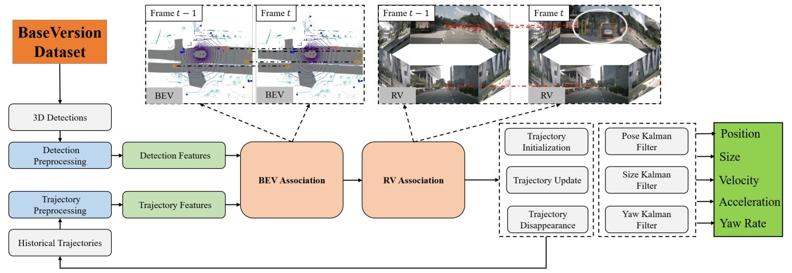

# McTrack论文精读

## 概要

这篇文档介绍了一种叫 **MCTrack** 的技术，专门用于自动驾驶里的“3D多目标跟踪”——简单说就是让自动驾驶汽车能实时“盯紧”周围的车、行人、自行车等物体，还能持续记录它们的位置、速度这些关键信息。下面用大白话拆解它的核心内容：

### 一、先解决了行业的3个大麻烦

之前的同类技术有不少痛点，MCTrack就是冲着这些问题来的：

1. **不同数据集“不兼容”，研究起来太麻烦**自动驾驶领域常用KITTI、nuScenes、Waymo这3个数据集（相当于“练习题库”），但它们记录数据的格式、场景（比如有的是城市路、有的是高速）、甚至标注方式都不一样。过去研究者得写好几套“预处理程序”才能用这些数据，特别耗时。MCTrack搞了个 **BaseVersion统一格式**，把这3个数据集的信息都转换成同一种“语言”（比如统一记录物体的位置、大小、速度等），这样研究者就能专心优化跟踪算法，不用再跟格式较劲。
2. **老技术“偏科”，在一个数据集好用，换一个就拉胯**之前很多跟踪技术只能在某一个数据集上表现好（比如在nuScenes上拿第一，到Waymo上就排中游），没法通用。而MCTrack是第一个在这3个主流数据集上都达到“顶尖水平”的技术：KITTI和nuScenes上排第一，Waymo上排第二（而且Waymo上排第一的技术用了更厉害的“探测器”，公平比的话MCTrack其实更优）。
3. **过去只看“有没有盯错物体”，不关心“物体动得对不对”**
   之前评价跟踪技术好不好，只看“有没有把A车一直认成A车”“有没有漏掉物体”（比如MOTA、HOTA这些指标），但自动驾驶更需要知道物体的 **运动信息准不准**——比如前车实际在减速，跟踪结果说它在加速，这会导致自动驾驶决策出错（比如没及时刹车）。
   MCTrack新增了一套 **运动评价指标**，专门检查速度、加速度、转向角度这些信息的准确性。比如“速度角度误差（VAE）”看方向对不对，“速度延迟误差（VDE）”看有没有滞后（比如前车1秒前就减速了，系统3秒后才发现，这就很危险）。

### 二、MCTrack是怎么实现“又准又通用”的？

核心靠3个关键设计：

1. **分开“盯”物体的不同属性，避免混乱**过去跟踪时，会把物体的位置、大小、朝向（比如车头朝左还是朝右）这些信息揉在一起用一个“过滤器”处理，很容易出错（比如位置单位是米，分数是0-1，放一起算会乱）。MCTrack用了 **3个独立的卡尔曼过滤器**，分别管“位置”（比如x/y坐标，用加速模型算）、“大小”（比如车长车宽，默认物体大小不变，过滤掉检测误差）、“朝向”（比如车头方向，结合实际检测和速度算），这样每个属性的跟踪都更准。
2. **更聪明的“匹配规则”，减少认错物体**跟踪的核心是“把当前帧的物体，和上一帧的物体对应上”（比如这一帧的车，是不是上一帧的那辆车）。过去常用的规则（比如IoU，看两个框重叠多少）有漏洞，比如两个车没重叠时就没法判断相似度。MCTrack搞了个 **Ro GDIoU规则**：既看两个物体的框重叠多少，又看它们中心的距离，还考虑朝向（比如车头方向一致的话，更可能是同一个物体），匹配准确率更高。
3. **两阶段匹配，解决“深度不准”的坑**
   自动驾驶常用“鸟瞰图（BEV）”看物体位置（像从天上往下看），但如果用摄像头检测，“深度”（物体离车多远）容易不准（误差可能达10米），导致BEV上匹配错物体。
   MCTrack的解决办法是：**第一阶段先在BEV上匹配**，没匹配上的物体，**第二阶段投影到图像平面（比如前视摄像头的画面）再匹配**——相当于“从天上看一遍，再从车头看一遍”，减少因为深度不准导致的认错（比如把远处的车和近处的车搞混）。

### 三、实验证明MCTrack确实好用

文档里做了大量测试，举两个关键结果：

- 在nuScenes上，MCTrack的“综合跟踪准确率（AMOTA）”达到76.3%，比之前的顶尖技术高0.5-1个百分点，而且“漏检数（FN）”和“认错物体次数（IDS）”都是最少的。
- 在运动信息准确性上，MCTrack用的卡尔曼过滤器，算出来的速度方向误差（VAE）只有6.3°，速度大小误差（VNE）只有0.56m/s，比“直接算位置差”“曲线拟合”这些老方法都准。

### 四、总结

MCTrack本质上是为自动驾驶量身定做的“3D多目标跟踪工具”：既解决了过去数据格式不统一、技术不通用的问题，又补上了“运动信息不准”的短板，而且在实际工程中能用（比如不用依赖昂贵的GPU，CPU就能跑）。最后还开源了代码（https://github.com/megvii-research/MCTrack），方便其他研究者继续优化。

## 流程图

  

这是自动驾驶里 **3D多目标跟踪（MCTrack）的工作流程图** ，用大白话拆解每一步：

### 1. 数据从哪来？——“BaseVersion Dataset” 打底

最左边的橙色框是 **“统一格式的数据集”** ，把KITTI、nuScenes这些常用自动驾驶数据，转成一样的格式（位置、速度、大小等信息统一），相当于给后续步骤提供 “标准食材”。

### 2. 前期准备：“预处理” 把数据变能用

- **Detection Preprocessing（检测预处理）**：先从数据集里拿 “每一帧的3D检测结果”（比如这一帧里有几辆车、行人，位置在哪），然后提取成 “Detection Features（检测特征）”—— 简单说就是把原始检测数据，整理成算法能看懂的 “特征向量”（比如位置用坐标、速度用数值存好）。
- **Trajectory Preprocessing（轨迹预处理）**：
  从 “Historical Trajectories（历史轨迹）” 里，把之前跟踪过的物体轨迹（比如上一帧、上上帧的车在哪），也整理成 “Trajectory Features（轨迹特征）”—— 同样是让算法能直接用的格式。

### 3. 核心匹配：“BEV + RV” 两阶段认物体

这是最关键的 “配对环节”，解决 “当前帧的物体，和上一帧的是不是同一个”：

- **BEV Association（鸟瞰图匹配）**：先把检测和轨迹的特征，投影到 **“BEV（Bird's Eye View，鸟瞰图）”** 上（想象从天上往下看路面，物体是一个个框）。这一步先粗筛，把可能是同一物体的 “候选对” 找出来。
- **RV Association（透视图匹配）**：
  再把这些候选对，投影到 **“RV（Raster View，透视图）”** 上（就是摄像头实际拍到的画面视角）。这一步相当于 “二次检查”—— 因为BEV里深度（物体离车多远）可能不准，换成透视图再匹配，减少认错（比如远处车和近处车在BEV里重叠，透视图里就能区分）。

### 4. 轨迹管理：跟踪上了，怎么更新？

配对完成后，进入 **“轨迹管理”** 模块，干3件事：

- **Trajectory Initialization（轨迹初始化）**：遇到新物体（之前没跟踪过的），给它建一条新轨迹，记录初始位置、速度这些信息。
- **Trajectory Update（轨迹更新）**：对已经在跟踪的物体，用新帧的数据更新它的轨迹（比如位置变了，速度怎么变的）。
- **Trajectory Disappearance（轨迹消失处理）**：
  物体离开摄像头视野（比如车拐走了），标记轨迹 “消失”，但暂时保留，防止它又出现时重新初始化（比如车又拐回来，直接续上之前的轨迹）。

### 5. 卡尔曼滤波：让运动信息更准

最后，用 **“卡尔曼滤波器”** 精细处理物体的运动属性，输出5类关键信息：

- **Pose Kalman Filter（位置卡尔曼滤波）**：算准物体在哪（x、y、z坐标）。
- **Size Kalman Filter（大小卡尔曼滤波）**：默认物体大小不变（车不会突然变大变小），过滤检测误差，让大小信息更稳。
- **Yaw Kalman Filter（朝向卡尔曼滤波）**：算准车头朝哪（比如左转、右转时，朝向怎么变）。
- 另外还输出 **速度（Velocity）、加速度（Acceleration）、角速度（Yaw Rate）** —— 这些运动信息，自动驾驶决策时要用（比如前车加速，本车可能也得加速；前车急转弯，本车得避让）。

### 总结一下流程逻辑：

1. 先把原始数据（检测、历史轨迹）整理成特征；
2. 用 “BEV + RV” 两阶段，把当前帧物体和历史轨迹配对；
3. 配对后，管理轨迹（新增、更新、标记消失）；
4. 最后用卡尔曼滤波，把物体的位置、大小、运动状态算得更准，输出给自动驾驶系统做决策。

整个流程就是为了让自动驾驶汽车，能持续、准确 “盯紧” 周围物体，知道它们在哪、怎么动，保障行驶安全～

## 正文

### 1. 引言

3D多目标跟踪在自动驾驶领域发挥着至关重要的作用，因为它是感知任务与规划任务之间的桥梁。跟踪结果会直接影响轨迹预测的性能，进而影响自车（智能汽车自身）的规划与控制。当前，常见的跟踪范式包括检测跟踪（TBD）[58, 61, 62]、注意力跟踪（TBA）[14, 48, 69]以及联合检测与跟踪（JDT）[3, 59]。一般而言，在性能表现和计算资源效率方面，检测跟踪（TBD）范式的方法往往优于注意力跟踪（TBA）和联合检测与跟踪（JDT）范式的方法。常用的数据集有KITTI [22]、Waymo [49]和nuScenes [5] ，这些数据集在采集场景、区域、天气和时间等方面存在显著差异。此外，不同数据集的难度和数据格式也有很大不同。研究人员常常需要编写多个预处理程序来适配不同的数据集。数据集之间的差异通常会导致这些方法仅能在特定某个数据集的范围内达到最优（SOTA）性能，在其他数据集上的表现则不尽如人意[26, 31, 32, 54]，如图1所示。例如，DetZero [36]在Waymo数据集上取得了最优性能，但未在其他数据集上进行测试。Fast - Poly [32]在nuScenes数据集上实现了最优性能，在Waymo数据集上却表现平平。同样，DeepFusion [58]在KITTI数据集上表现出色，在nuScenes数据集上却只是平均水平。

此外，在性能评估方面，现有的指标如CLEAR [4]、AMOTA [61]、HOTA [35]、IDF1 [43]等，主要用于判断轨迹是否正确连接。然而，它们在评估后续运动信息（如速度、加速度和角速度等关键信息）的精度方面存在不足，而这些运动信息对于满足下游预测和规划任务的需求至关重要[31, 54, 58]。

为了解决上述挑战，我们首先引入了BaseVersion格式，以标准化不同数据集的感知结果（即检测结果）。这种统一格式对研究人员有很大帮助，使他们能够专注于推进多目标跟踪（MOT）算法，而无需受特定数据集差异的困扰。

其次，本文提出了一个名为MCTrack的统一多目标跟踪框架。据我们所知，我们的方法是首个在三个最常用的跟踪数据集（KITTI、nuScenes和Waymo）上均实现最优（SOTA）性能的方法。具体而言，它在KITTI和nuScenes数据集上均排名第一，在Waymo数据集上排名第二。值得注意的是，Waymo数据集上排名第一的方法所使用的检测器明显优于我们所使用的检测器。此外，该方法是从实际工程应用的角度进行设计的，所提出的模块能够解决现实中的问题。例如，我们的两阶段匹配策略中，第一阶段在鸟瞰图（BEV）平面上执行大部分轨迹匹配。然而，对于基于摄像头的感知结果，在BEV平面上进行匹配可能会因深度信息不稳定而遇到挑战，在实际工程场景中，深度信息的误差可能高达10米。为了解决这个问题，在BEV平面上匹配失败的轨迹会被投影到图像平面进行二次匹配。这一过程有效避免了因深度信息不准确而导致的身份切换（ID - Switch，IDSW）和片段化（Fragmentation，Frag）等问题，进一步提高了跟踪的准确性和可靠性。

最后，本文引入了一组用于评估多目标跟踪（MOT）系统输出的运动信息的指标，包括速度、加速度和角速度。我们希望研究人员不仅关注轨迹的正确连接，还能考虑在正确匹配后，如何准确提供下游预测和规划所需的运动信息，如速度和加速度 。

（注：“arXiv:2409.16149v2 [cs.CV] 14 Oct 2024”是论文在arXiv平台的标识，一般无需翻译，保留即可 ；“*Equal contribution.”可译为“*同等贡献” ；“†Corresponding author. Email: zhouhangning@megvii.com”可译为“†通讯作者。电子邮箱：zhouhangning@megvii.com”  ）

### 2. 相关工作（Related Work）

“相关工作”章节是对自动驾驶3D多目标跟踪领域现有研究成果的梳理与总结，目的是明确当前研究的基础、不足，以及本文工作的定位，具体从4个核心方向展开：

#### 2.1 数据集（Datasets）

多目标跟踪按空间维度可分为**图像平面的2D跟踪**和**真实世界的3D跟踪**，两类跟踪方法依赖的数据集存在显著差异：

- **2D跟踪数据集**：以MOT17、MOT20、DanceTrack为代表，这类数据集仅提供图像层面的信息，通常通过计算2D交并比（IoU）或外观特征相似度来实现目标匹配。但由于缺乏物体在真实世界中的三维信息（如距离、高度），无法满足自动驾驶对“感知真实物理空间”的需求，因此不适用于自动驾驶场景。
- **3D跟踪数据集**：主流的有KITTI、nuScenes、Waymo，它们能提供丰富的传感器信息（如激光雷达点云、摄像头图像），可捕捉物体的三维空间信息，是自动驾驶3D多目标跟踪研究的核心数据支撑。但这三类数据集存在明显缺陷——**格式差异极大**，且采集场景（如城市道路、高速路）、标注难度、数据维度等均不统一，导致研究人员需编写多套预处理程序才能适配不同数据集，尤其对“检测跟踪（TBD）”这类依赖检测结果的范式而言，不同数据集的检测格式给算法开发带来了极大阻碍。为此，本文提出了BaseVersion格式，用于统一这三类数据集的感知结果（检测数据），解决格式不兼容问题。

#### 2.2 多目标跟踪范式（MOT Paradigm）

当前多目标跟踪领域存在4类主流范式，本文重点分析了它们的适用性与局限性：

- **核心范式分类**：包括检测跟踪（TBD）、联合检测与跟踪（JDT）、注意力跟踪（TBA）、参考多目标跟踪（RMOT）。
- **各范式特点与适用性**：
  - JDT、TBA、RMOT范式：普遍依赖图像特征信息，需要GPU资源进行复杂计算。但自动驾驶车辆的车载计算能力有限，难以支撑这类范式对GPU的需求；同时，它们的跟踪性能通常不如TBD范式。
  - TBD范式：在性能表现和计算资源效率上均优于其他三类范式，更符合自动驾驶“实时性”“低算力消耗”的工程需求。因此，本文聚焦于TBD范式，旨在设计适配自动驾驶计算约束的统一3D多目标跟踪框架。

#### 2.3 数据关联（Data Association）

数据关联是多目标跟踪的核心环节，负责将当前帧的检测结果与历史轨迹匹配，现有方法存在明显不足，本文也针对性提出了改进思路：

- **现有成本函数的缺陷**：2D和3D跟踪中常用的成本函数（如IoU、GIoU、DIoU、欧氏距离、外观相似度）均有局限——部分仅考虑边界框形状相似度，部分仅关注中心点距离，无法在所有数据集、所有目标类别上保证稳定性能。为此，本文提出“Ro GDIoU”成本函数，结合了形状相似度与中心点距离，同时融入检测框朝向信息，弥补了现有函数的不足。
- **现有匹配策略的不足**：多数方法采用“两阶段阈值调整”策略（第一阶段用严格阈值匹配，第二阶段放宽阈值再匹配），但当感知深度存在大幅波动时（如摄像头深度检测误差大），这种策略易失效。本文提出“基于鸟瞰图（BEV）与距离视图（RV）的两阶段匹配”，从不同视角进行匹配，有效解决了深度波动导致的匹配问题。

#### 2.4 多目标跟踪评估指标（MOT Evaluation Metrics）

现有评估指标存在“重轨迹连接、轻运动信息”的缺陷，无法满足自动驾驶下游任务需求：

- **传统静态指标的局限**：最早的CLEAR指标（含MOTA、MOTP）及后续改进的IDF1、HOTA、AMOTA等，均仅评估“轨迹连接正确性”（如轨迹是否连续、有无身份切换、有无断裂），但忽略了轨迹连接后必须输出的**运动信息**（速度、加速度、角速度）——而这些信息对自动驾驶的轨迹预测、路径规划、车辆控制等下游任务至关重要。
- **本文的改进方向**：针对这一缺陷，本文提出“运动指标（motion metrics）”，专门评估多目标跟踪系统输出的运动信息质量，呼吁领域内研究人员不仅关注轨迹关联精度，还需重视轨迹输出能否满足下游任务对运动信息的需求。

### 3.1 数据预处理（Data Preprocessing）：给不同数据集“统一语言”

这部分的核心目标是**解决不同数据集格式不兼容的问题**，让一套跟踪流程（pipeline）能在KITTI、nuScenes、Waymo等数据集上通用，同时方便其他研究者直接使用，具体做了两件关键事：

#### 1. 制定“BaseVersion统一格式”：把不同数据“转成同一种语言”

为了验证“统一跟踪流程”在不同数据集上的性能，也为了减少研究者的预处理工作量，研究团队将各数据集的“检测数据”（比如每帧图像里车、行人的位置、大小等信息）标准化，定义为 **BaseVersion格式**。
简单说，就是不管原始数据集（KITTI/nuScenes/Waymo）用什么格式记录信息，都按照BaseVersion的规则重新整理——比如统一用“全球坐标系”记录障碍物位置，再按“场景ID（比如哪段路的场景）”“帧序列（比如视频的第1帧、第2帧）”等维度分类存储，让不同数据集的信息结构完全一致。

#### 2. 明确BaseVersion格式的“核心内容”：记录哪些关键信息

BaseVersion格式的结构可以通过图3（BaseVersion数据格式总览）直观看到，整体按“场景-帧-检测框”的层级组织，具体包含两类核心信息：

- **帧层面信息**：每一段场景包含多帧数据，每帧会详细记录“帧编号（比如第100帧）”“时间戳（比如几点几分采集）”“唯一标识（避免和其他帧混淆）”“检测框集合（这一帧里所有障碍物的框）”“转换矩阵（用于不同坐标系间的计算）”等基础数据。
- **检测框层面信息**：每个障碍物的检测框（比如某辆车的3D框）会记录更细致的属性，包括：
  - 基础属性：“检测得分（判断这个框是真实物体的可信度）”“类别（是车、行人还是自行车）”；
  - 空间属性：“全球坐标系下的xyz坐标（物体在真实世界的位置）”“lwh（长、宽、高）”“全球朝向（用四元数表示，避免角度计算的歧义）”“全球偏航角（用弧度表示，车头朝哪个方向）”；
  - 运动属性：“全球速度”“全球加速度”（这两个是后续下游任务需要的关键运动信息）。

如果需要更细节的格式说明，研究团队也提示可以参考他们公开的代码仓库。
总的来说，这一步数据预处理的本质是“做数据的‘翻译官’和‘整理员’”——通过统一格式，消除不同数据集的差异，为后续MCTrack框架的“统一跟踪”打下基础，也让其他研究者不用再为适配不同数据集写额外代码。

### 3.2.1 卡尔曼滤波器（Kalman Filter）：让跟踪“又稳又准”的核心工具

在MCTrack框架中，卡尔曼滤波器的作用是 **“预测并修正物体的状态”**——简单说，就是根据物体过去的位置、大小、朝向等信息，预判它下一帧可能的状态，再结合当前帧的检测结果，修正预判误差，最终输出稳定、准确的跟踪结果。

过去的3D多目标跟踪方法常把物体的所有状态（位置、大小、朝向、得分、速度等）揉在一个11维的向量里，用同一个滤波器处理，这会导致3个关键问题：

1. **单位和量级混乱**：比如位置单位是“米”（数值可能几十上百），得分是“0-1”的概率值，放一起计算会让滤波器“分不清主次”，出现数值不稳定；
2. **线性与非线性矛盾**：位置、大小是线性变化的（比如车不会突然从5米长变10米），但朝向（角度）是周期性的（360°和0°是同一个方向），用统一的线性运动模型（如匀速模型）描述会出错；
3. **计算复杂**：高维向量会增加计算量，影响自动驾驶的实时性。

为此，MCTrack提出 **“拆分滤波”策略**：把物体的状态拆成“位置”“大小”“朝向”三类，用3个独立的卡尔曼滤波器分别处理，既解决了上述问题，又提升了跟踪精度。下面逐一解释每个滤波器的设计：

#### 1. 位置卡尔曼滤波器：精准预测物体“下一步在哪”

- **核心目标**：跟踪物体在鸟瞰图（BEV）平面的中心位置（x、y坐标，z坐标在BEV中暂不重点考虑），并修正位置误差。
- **运动模型选择**：用 **“恒加速模型”**——假设物体的加速度基本不变（比如车匀速行驶时加速度为0，刹车时加速度为固定负值），更符合真实道路上物体的运动规律。
- **状态向量（Sₚ）与观测向量（Mₚ）**：
  - 状态向量（记录“真实状态”，包含预测项）：

    $$
    S_p = \{x, y, v_x, v_y, a_x, a_y\}
    $$

    其中，x、y是当前位置，$v_x$、$v_y$是x/y方向的速度，$a_x$、$a_y$是x/y方向的加速度（这两项是滤波器预测时的关键）；
  - 观测向量（记录“当前检测到的状态”，用于修正）：

    $$
    M_p = \{x, y, v_x, v_y\}
    $$

    只包含能直接检测到的位置和速度（加速度无法直接检测，靠滤波器推算）。

简单说，这个滤波器会先根据上一帧的位置、速度、加速度，预判当前帧的位置；再用当前帧检测到的位置和速度，修正预判值，得到最终的精准位置。

#### 2. 大小卡尔曼滤波器：保证物体“不会忽大忽小”

- **核心目标**：跟踪物体的长度（l）和宽度（w），过滤检测误差（比如激光雷达偶尔会把车长误测为4.2米或3.8米），保证大小稳定。
- **运动模型选择**：用 **“恒速模型”**——理论上，同一物体的大小是固定的（车不会突然变长或变宽），但检测会有误差，所以假设“大小的变化速度为0”（即恒速为0），用滤波器平滑波动。
- **状态向量（Sₛ）与观测向量（Mₛ）**：
  - 状态向量：

    $$
    S_s = \{l, w, v_l, v_w\}
    $$

    其中，l、w是当前大小，$v_l$、$v_w$是大小的“变化速度”（理想状态下为0）；
  - 观测向量：

    $$
    M_s = \{l, w\}
    $$

    只包含当前检测到的长度和宽度（变化速度靠滤波器推算，且会被约束为接近0）。

比如，某辆车的真实长度是4米，某一帧检测为4.2米，滤波器会结合历史帧的4米数据，把4.2米修正为接近4米的数值，避免大小“跳变”。

#### 3. 朝向卡尔曼滤波器：准确判断物体“车头朝哪”

- **核心目标**：跟踪物体的朝向角（θ，比如车头朝东还是朝北），解决“检测朝向不准”和“角度周期性歧义”（比如359°和1°其实只差2°）的问题。
- **运动模型选择**：用 **“恒速模型”**——假设朝向角的变化速度（角速度）基本不变（比如车转弯时，车头朝向的变化是平稳的）。
- **关键设计**：引入“双朝向角”（感知朝向+速度朝向），互相验证修正：
  - 感知朝向（θₚ）：直接从检测结果中获取的朝向角（比如激光雷达检测到车头朝30°）；
  - 速度朝向（θᵥ）：通过物体的速度计算得到的朝向角：

    $$
    \theta_v = \arctan\left(\frac{v_y}{v_x}\right)
    $$

    比如车往x正方向、y正方向运动，速度朝向就是45°。
- **状态向量（S_θ）与观测向量（M_θ）**：
  - 状态向量：

    $$
    S_\theta = \{\theta_p, \theta_v, \omega_p, \omega_v\}
    $$

    其中，$\theta_p$、$\theta_v$是两个朝向角，$\omega_p$、$\omega_v$是它们的变化速度（角速度）；
  - 观测向量：

    $$
    M_\theta = \{\theta_p, \theta_v\}
    $$

    包含当前检测到的感知朝向，和当前计算出的速度朝向。

比如，检测到的感知朝向是30°，但根据速度计算的朝向是35°，滤波器会结合历史数据，判断哪个更可信，最终输出一个接近真实朝向的结果（比如32°），避免单一检测的误差。

### 总结：拆分滤波的核心优势

把“位置、大小、朝向”分开用3个卡尔曼滤波器处理，本质是 **“让专业的工具做专业的事”**：

- 位置用恒加速模型，适配真实运动；
- 大小用恒速模型，约束稳定不变；
- 朝向用双角度验证，解决周期性歧义。
  最终既避免了过去“混在一起算”的混乱，又提升了跟踪的精度和稳定性，还降低了计算复杂度，符合自动驾驶“实时、精准”的需求。

### 3.2.2 代价函数（Cost Function）：给“目标匹配”定一把“精准尺子”

在MCTrack的跟踪流程中，“代价函数”的核心作用是 **判断“当前帧检测到的物体”与“历史跟踪的轨迹”是不是同一个目标**——比如判断这一帧的“车A”，和上一帧跟踪的“车A”是否为同一辆车。代价函数会计算两者的“相似度代价”：代价越小，说明两者越可能是同一个目标，匹配成功率越高。

过去的代价函数（如IoU、GIoU、DIoU、欧氏距离）存在明显缺陷，无法满足3D多目标跟踪的需求，因此研究团队提出了 **Ro GDIoU（基于鸟瞰图的IoU变体）** 作为核心代价函数，并结合“双向预测”进一步优化匹配精度，具体设计如下：

#### 1. 先解决老方法的“短板”：为什么需要新的代价函数？

现有代价函数在3D跟踪场景中存在3类关键问题，无法全面衡量目标相似度：

- **GIoU的局限**：当两个目标的检测框完全包含（比如大框套小框）时，GIoU会退化成普通IoU，无法区分两者的相对位置关系（比如小框在大框中心，还是在角落），导致匹配判断失误。
- **DIoU的局限**：当两个目标的IoU为0（无重叠）且中心距离相等时，DIoU无法判断两者的相似度（比如两个相同大小的车，和跟踪轨迹的中心距离相同，但一个在正前方、一个在侧方，DIoU会认为两者相似度一样，显然不符合实际）。
- **单一指标的不足**：仅用欧氏距离（测中心远近）或IoU类指标（测框重叠度），无法覆盖所有目标类别的匹配需求（比如对细长的行人，距离比重叠度更重要；对宽大的卡车，重叠度比距离更关键）。

为此，Ro GDIoU的核心思路是 **“融合IoU类指标和距离指标，并加入朝向角信息”**，让代价计算更全面、精准。

#### 2. 核心创新：Ro GDIoU的计算逻辑

Ro GDIoU是基于 **鸟瞰图（BEV平面）** 设计的代价指标（因为BEV能更直观反映目标在真实道路上的位置关系），计算时会综合考虑3个维度：目标框的重叠度、中心距离、朝向角，具体步骤可参考图5（Ro GDIoU计算示意图）和算法1（伪代码），核心公式逻辑如下：

- **第一步：计算基础Ro IoU**：先将当前检测框（Bd）和历史轨迹框（Bt）投影到BEV平面，得到BEV视角下的两个2D框（Bd_bev、Bt_bev），再计算两者的“交并比（IoU）”，作为基础相似度指标（Ro IoU = 交集面积 / 并集面积）。
- **第二步：加入“最小包围矩形”修正项**：找到能同时包含两个BEV框的“最小包围矩形（C）”，计算“(C的面积 - 两个框的并集面积) / C的面积”，这个值越小，说明两个框的位置越集中，相似度越高。
- **第三步：加入“中心距离”修正项**：计算两个BEV框中心点的欧氏距离（c），再计算最小包围矩形的对角线距离（d），用“c²/d²”衡量中心距离对相似度的影响——距离越近，这个值越小，相似度越高。
- **第四步：加权融合得到Ro GDIoU**：用权重ω₁和ω₂（ω₁+ω₂=2）分别对“最小包围矩形修正项”和“中心距离修正项”加权，再从基础Ro IoU中减去这两项，最终得到Ro GDIoU：

  $$
  Ro_GDIoU = Ro_IoU - ω₁ * (C - U) / C - ω₂ * (c² / d²)
  $$

  其中，C是最小包围矩形面积，U是两个BEV框的并集面积。

  - 理想情况：当两个框完全匹配时，Ro IoU=1，(C-U)/C=0，c²/d²=0，此时Ro GDIoU=1（代价最小，相似度最高）；
  - 最差情况：当两个框距离极远时，Ro IoU=0，(C-U)/C≈1，c²/d²≈1，此时Ro GDIoU≈-2（代价最大，相似度最低）。

此外，Ro GDIoU还隐含了 **朝向角信息**：因为在将3D框投影到BEV平面时，目标的朝向角（θ）会直接影响BEV框的旋转方向——只有朝向角一致的目标，其BEV框的重叠度才会更高，间接让朝向角成为相似度判断的一部分，避免将“朝向相反的同类型目标”误匹配（比如车头朝东的车和车头朝西的车，即使位置近，BEV框重叠度也低，Ro GDIoU代价会变大）。

#### 3. 进一步优化：结合“双向预测”的代价计算

为了减少“单帧检测误差”对匹配的影响（比如某一帧检测框位置偏移），研究团队还将Ro GDIoU与“双向预测”结合，最终的代价函数（ℒ_cost）公式如下：

#### 总结：Ro GDIoU代价函数的核心价值

相比传统代价函数，Ro GDIoU的优势在于 **“更贴合自动驾驶3D跟踪的实际需求”**：

1. 基于BEV平面计算，能反映目标在真实道路上的位置关系，比图像平面的指标更实用；
2. 融合重叠度、中心距离、朝向角信息，避免单一指标的片面性；
3. 结合双向预测，减少检测误差对匹配的影响，提升跟踪稳定性。
   最终，这个代价函数为MCTrack的“两阶段匹配”提供了精准的“相似度尺子”，是实现高准确率跟踪的关键基础。

### 3.2.3 两阶段匹配（Two-Stage Matching）：从“双视角”解决匹配难题

在MCTrack的3D多目标跟踪流程中，“两阶段匹配”是**连接“历史轨迹”与“当前检测框”的核心环节**——目的是精准判断“当前帧里的物体”和“上一帧跟踪的物体”是否为同一个目标。与传统两阶段匹配（仅调整阈值）不同，MCTrack的创新点在于**从“鸟瞰图（BEV）”和“距离视图（RV）”两个不同视角分步匹配**，专门解决“深度信息不准导致的匹配失误”问题（比如摄像头检测时，物体距离误差可能达10米，仅靠BEV视角易认错目标），具体流程可参考算法2（两阶段匹配伪代码），拆解如下：

#### 1. 核心背景：为什么需要“双视角”匹配？

自动驾驶中，基于摄像头的感知结果存在“深度信息不稳定”的痛点——比如远处的车和近处的车，在鸟瞰图（BEV）上可能因深度误差导致位置偏移，仅靠BEV视角匹配容易出现“身份切换（IDSW）”或“轨迹片段化（Frag）”。
而“距离视图（RV）”是从“传感器视角”（如激光雷达或摄像头的实际观测角度）呈现目标，能补充BEV视角缺失的“前后距离细节”。因此，MCTrack设计“BEV先匹配、RV再补漏”的两阶段策略，兼顾“全局位置判断”和“局部细节修正”。

#### 2. 第一阶段：鸟瞰图（BEV）匹配——粗筛“高相似度候选对”

这一阶段的目标是**快速筛选出“大概率为同一目标”的匹配对**，减少后续计算量，具体步骤：

- **步骤1：坐标转换——3D框转BEV框**将上一帧的“轨迹框（T，τ-1时刻）”和当前帧的“检测框（D，τ时刻）”，通过公式（7）-（9）投影到BEV平面（鸟瞰图视角），得到BEV视角下的2D框（T_bev、D_bev）。转换逻辑：先根据3D框的位置（x,y,z）、大小（l,w,h）、朝向角（θ），计算出8个顶点坐标（公式8的P矩阵是顶点基础坐标，公式7的R是旋转矩阵、T是平移矩阵，两者结合得到真实世界中的顶点坐标），再筛选出BEV平面的4个顶点（索引[2,3,7,6]），构成BEV框。
- **步骤2：计算代价——用Ro GDIoU衡量相似度**对每一对“T_bev-D_bev”，通过3.2.2节的Ro GDIoU代价函数计算“匹配代价”（代价越小，相似度越高），形成代价矩阵。
- **步骤3：最优匹配——匈牙利算法筛选**
  将代价矩阵输入匈牙利算法，结合预设阈值（threshold_bev），筛选出“总代价最小”的匹配对（M_bev）——这些是BEV视角下“高度可信”的匹配结果，剩余未匹配的检测框（D_res）和轨迹框（T_res）则进入第二阶段。

#### 3. 第二阶段：距离视图（RV）匹配——补漏“BEV未匹配目标”

这一阶段的目标是**解决“BEV匹配失败”的漏网目标**，尤其是因深度误差导致BEV框偏移的情况，具体步骤：

- **步骤1：筛选未匹配目标**从第一阶段结果中，提取“未匹配的检测框（D_res，即D_bev中未出现在M_bev中的框）”和“未匹配的轨迹框（T_res，即T_bev中未出现在M_bev中的框）”。
- **步骤2：坐标转换——3D框转RV框**通过函数F₃d→rv，将D_res和T_res投影到“距离视图（RV）”平面——RV视角更贴近传感器的实际观测（比如激光雷达的“径向距离”视图），能更精准反映目标的前后位置关系，弥补BEV视角的深度误差。
- **步骤3：计算代价与匹配——贪心算法补漏**用“SDIoU”（一种适配RV视角的相似度指标，细节参考[57]）计算“D_res_rv-T_res_rv”的匹配代价，再通过贪心算法（结合阈值threshold_rv）筛选出“次优匹配对（M_rv）”——贪心算法更适合小批量未匹配目标，计算效率更高。
- **步骤4：合并结果——得到最终匹配对**
  将第一阶段的M_bev和第二阶段的M_rv合并，得到最终的匹配结果（M = M_bev ∪ M_rv）——既包含BEV视角的高可信匹配，也补充了RV视角的漏网匹配，最大程度减少因深度误差导致的匹配失误。

#### 4. 核心优势：为什么“双视角两阶段”比传统方法更优？

传统两阶段匹配多是“同一视角下调整阈值”（第一阶段严阈值、第二阶段松阈值），无法解决“视角本身的缺陷”（如BEV的深度误差）。而MCTrack的创新在于：

- **视角互补**：BEV擅长全局位置判断（比如目标在道路的左右位置），RV擅长局部细节修正（比如目标的前后距离），两者结合覆盖“平面位置+深度信息”，减少单一视角的盲区；
- **工程适配**：仅对BEV未匹配的目标进行RV匹配，兼顾“精度”和“效率”——避免全量目标都走双视角，符合自动驾驶的实时性需求；
- **减少失误**：有效规避因深度不准导致的IDSW（身份切换）和Frag（轨迹片段化），比如BEV中因深度误差“错位”的两个框，在RV视角下能通过前后距离判断出不是同一目标，从而避免误匹配。

综上，两阶段匹配是MCTrack实现“高稳健性跟踪”的关键环节——通过“BEV粗筛+RV补漏”的双视角策略，既解决了传统匹配的视角局限，又适配了自动驾驶的工程需求，为后续轨迹更新和运动信息输出打下精准基础。

### 4. 新的多目标跟踪评估指标（New MOT Evaluation Metrics）：补上“运动信息评估”的短板

在自动驾驶3D多目标跟踪领域，传统评估指标只关注“轨迹有没有连对”，却忽略了自动驾驶更需要的“运动信息准不准”——比如车的速度、加速度算错了，会直接导致自动驾驶决策失误（如没及时刹车）。因此，本文在传统指标基础上，首次提出“静态指标+运动指标”结合的评估体系，既衡量“轨迹连接正确性”，也考核“运动信息准确性”，具体内容如下：

#### 4.1 静态指标（Static Metrics）：传统指标的定位与局限

“静态指标”指的是过去常用的评估指标，核心作用是**判断“轨迹是否正确连接”**，比如有没有把“车A”一直认成“车A”、有没有漏检或误检，具体包括CLEAR（含MOTA、MOTP）、AMOTA、HOTA、IDF1等（文档1-69、1-71）。
但这些指标存在明显缺陷：**只看“轨迹连没连对”，不看“连对后输出的运动信息准不准”**。比如，某算法能稳定跟踪一辆车（静态指标优秀），但算出来的“车速”比实际快10m/s（运动信息错误），这种情况在传统评估中会被判定为“好算法”，但在自动驾驶中会引发安全风险——因为下游的轨迹预测、路径规划都依赖准确的速度、加速度信息（文档1-71、1-74）。
因此，静态指标无法全面反映跟踪算法的“实际应用价值”，必须补充运动指标。

#### 4.2 运动指标（Motion Metrics）：聚焦“运动信息准确性”的新指标

为解决静态指标的局限，本文提出6类**专门评估“运动信息输出质量”的指标**，覆盖“速度方向、速度大小、速度稳定性、响应延迟”等自动驾驶关键需求，所有指标均基于nuScenes数据集的“真实运动标签（Ground Truth）”计算，具体如下（文档1-76至1-91）：

| 指标名称（缩写）         | 核心作用                                     | 计算逻辑与解读                                                                                                                                                                                         |
| ------------------------ | -------------------------------------------- | ------------------------------------------------------------------------------------------------------------------------------------------------------------------------------------------------------ |
| 速度角度误差（VAE）      | 衡量“跟踪算的速度方向”与“真实方向”的偏差 | 计算跟踪速度角度（θ_d）与真实速度角度（θ_gt）的差值，考虑角度周期性（如359°与1°实际差2°）。VAE越小，方向越准（公式10）。                                                                          |
| 速度角度反向误差（VAIE） | 检测“速度方向是否完全反了”                 | 当VAE超过90°（π/2弧度）时，计算具体误差值——这意味着算法把“向前走”误判为“向后走”，是严重错误（公式11）。                                                                                        |
| 速度反向率（VIR）        | 统计“速度方向完全反了”的比例               | 计算VAIE出现的次数占总轨迹长度的百分比。VIR越低，算法越不容易出现方向误判（公式12）。                                                                                                                  |
| 速度大小误差（VNE）      | 衡量“跟踪算的速度大小”与“真实大小”的偏差 | 计算跟踪速度大小（V_d）与真实速度大小（V_gt）的绝对值差。VNE越小，速度大小越准（公式13）。                                                                                                             |
| 速度平滑度误差（VSE）    | 衡量“速度曲线是否平稳”                     | 用Savitzky-Golay（SG）滤波器对跟踪速度做平滑处理，计算原始速度与平滑后速度的差值（公式14-15）。VSE越小，速度曲线越平稳（避免忽快忽慢，利于自动驾驶决策）。                                             |
| 速度延迟误差（VDE）      | 衡量“速度检测是否滞后”                     | 找真实速度序列中的峰值点（如前车突然减速的时刻），计算跟踪速度比真实速度“晚多久”响应（公式16-22）。VDE越小，响应越快——比如前车1秒前减速，算法0.5秒内检测到，比3秒后检测到更安全（图6有直观案例）。 |

#### 提出新指标的核心意义

1. **填补评估空白**：首次将“运动信息质量”纳入多目标跟踪评估，让算法评估从“只看轨迹连接”升级为“连接+运动双达标”，更贴合自动驾驶的实际需求。
2. **引导研究方向**：鼓励研究者不仅关注“如何把轨迹连对”，更要重视“连对后如何输出准确的速度、加速度”——比如文档中实验显示，卡尔曼滤波器的VAE（6.3°）、VNE（0.56m/s）均优于“直接求差”“曲线拟合”等方法，证明运动指标能有效区分不同算法的运动信息精度（文档1-127、1-131）。
3. **支撑下游任务**：准确的运动指标能确保跟踪算法输出的信息“可用”——比如VDE小意味着自动驾驶能及时响应前车减速，VSE小意味着速度预测更平稳，这些都直接影响行车安全（文档1-91）。

综上，“4. New MOT Evaluation Metrics”章节的核心价值在于：**重构了3D多目标跟踪的评估体系**，用“静态指标+运动指标”双维度，既保证轨迹连接的正确性，又确保运动信息的实用性，为自动驾驶场景下的算法评估提供了更全面、更贴合工程需求的标准。
