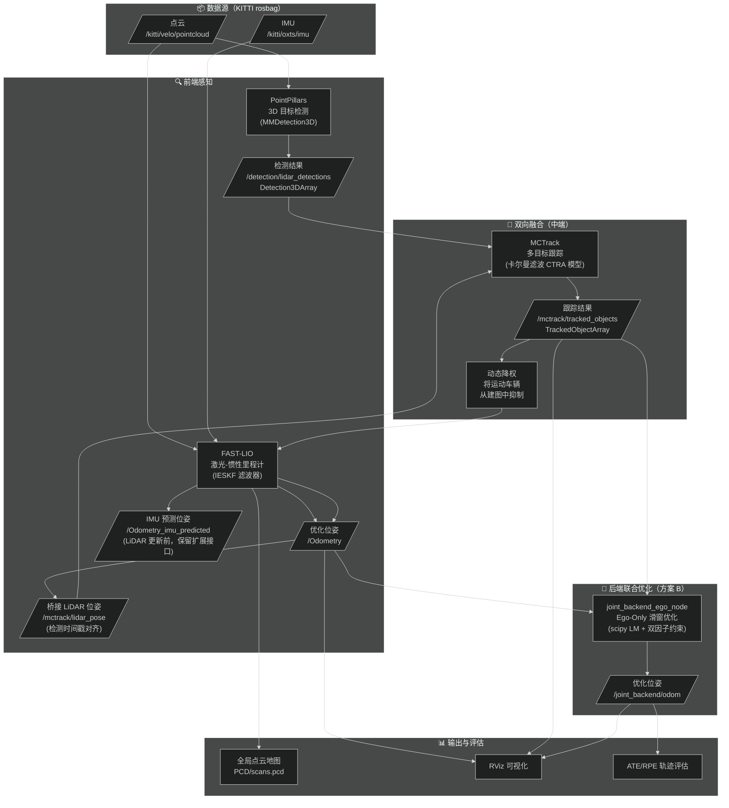
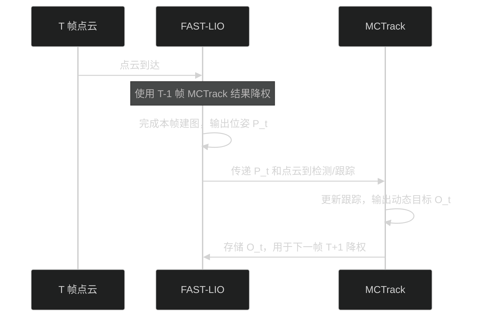
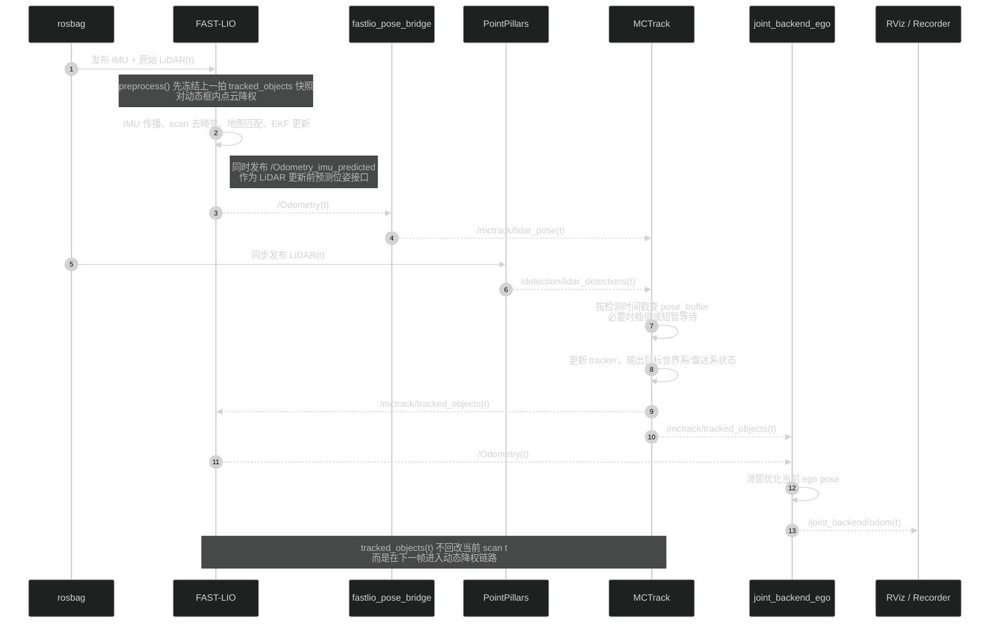
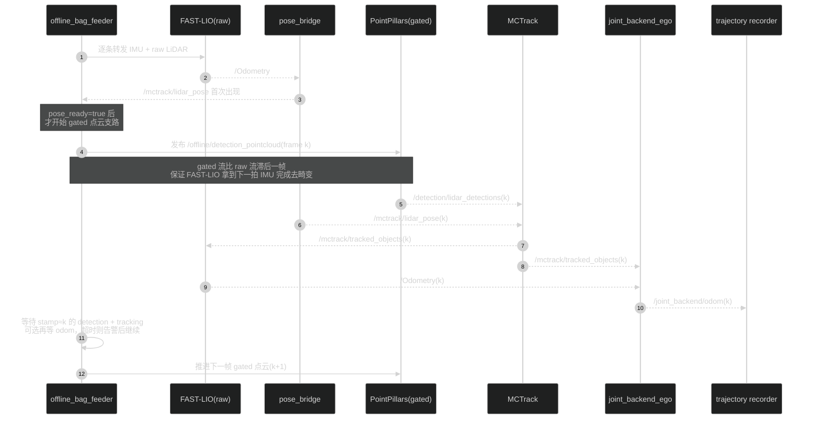
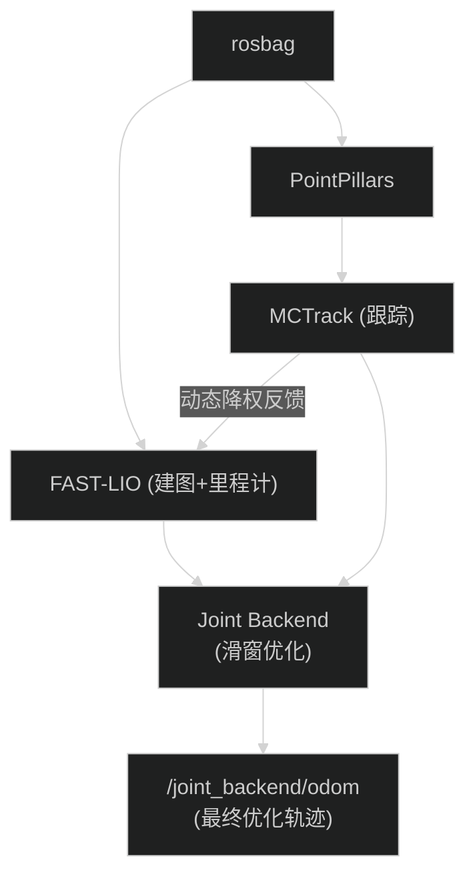
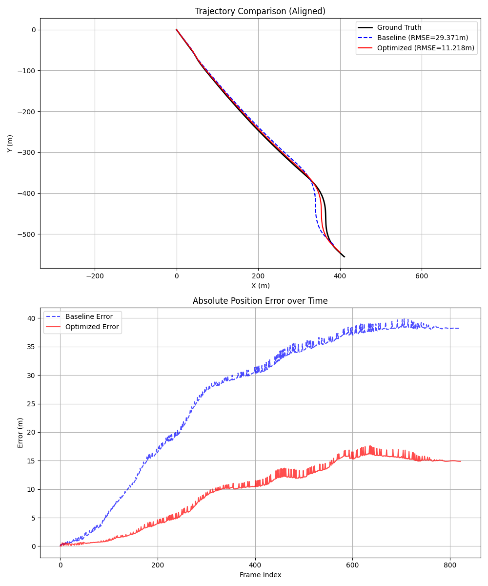

# ME5400: Advanced Robotics and Autonomous Systems

[](https://opensource.org/licenses/MIT)
[](http://wiki.ros.org/noetic)
[](https://www.python.org/)

这是ME5400高级机器人与自主系统课程项目，聚焦于**FAST-LIO 里程计与 MCTrack 多目标跟踪的融合管线**，用于自动驾驶场景下将实时点云/IMU 位姿与三维目标检测数据统一处理并可视化。

## 目录

- [📋 项目介绍](#-项目介绍)
- [📁 目录结构](#-目录结构)
- [📊 实验结果](#-实验结果)
- [🛠️ 环境与安装](#️-环境与安装)
- [📊 数据准备](#-数据准备)
- [🎯 使用指南](#-使用指南)
- [🤖 Agent 开发工作流](#-agent-开发工作流)
- [🔧 配置说明](#-配置说明)

## 📋 项目介绍

本项目实现了一个**基于激光雷达的 SLAM 与 多目标跟踪（MOT）双向融合闭环系统**。项目核心旨在探索里程计与跟踪任务的互补特性：利用 FAST-LIO 的高频精准位姿增强 MCTrack 的跟踪稳定性，同时利用 MCTrack 的动态目标感知反哺 FAST-LIO 以消除动态鬼影，提升建图精度。

### 🔄 项目思路及实现原理

本项目围绕一个核心问题展开：**自动驾驶场景中，路上运动的车辆会干扰激光雷达建图和定位，如何让 SLAM 与目标跟踪互相帮助、共同提升精度？**

整个系统分为三层：**前端感知**、**双向融合**、**后端联合优化**。下图展示了完整数据流：



---

#### 第一层：前端感知 — 「看见世界」

| 模块                   | 作用                                                                  | 关键输出                        |
| ---------------------- | --------------------------------------------------------------------- | ------------------------------- |
| **PointPillars** | 将每帧点云转化为「哪里有什么车」的 3D 检测框                          | `/detection/lidar_detections` |
| **FAST-LIO**     | 融合激光雷达 + IMU，以 IESKF 迭代误差状态卡尔曼滤波器计算自车实时位姿 | `/Odometry`                   |

> 💡 **通俗理解**：PointPillars 是「眼睛」，负责看清前方有哪些车；FAST-LIO 是「内耳」，负责感知自身在哪里、朝哪走。

---

#### 第二层：双向融合 — 「互相帮忙」

这是本项目的核心创新，两个模块形成**闭环反馈**：

**① FAST-LIO ➡️ MCTrack（里程计帮助跟踪）**

- FAST-LIO 会持续输出稳定的自车位姿 `/Odometry`，并额外对外发布 LiDAR 更新前的 `/Odometry_imu_predicted`
- 当前仓库实现中，`fastlio_pose_bridge` 会将 `/Odometry` 转成 `/mctrack/lidar_pose`，MCTrack 再按检测时间戳对位姿做插值/对齐
- 效果：跟踪更稳定，不容易在快速转弯时丢失目标；同时保留 `/Odometry_imu_predicted` 作为高频预测位姿接口，便于后续扩展

**② MCTrack ➡️ FAST-LIO（跟踪帮助建图）**

- MCTrack 输出每辆被跟踪车辆的**3D 包围盒 + 速度 + 置信度**
- FAST-LIO 收到后，对落在这些动态框内的激光点进行**自适应降权**：
  - 车速越快 → 权重越低（几乎忽略）
  - 置信度越高 → 降权越激进
- 效果：动态车辆不再被「误当成路边建筑物」写入地图，消除**动态鬼影**，地图更干净

> 💡 **通俗理解**：FAST-LIO 告诉 MCTrack「我在这里，帮你算目标在哪」；MCTrack 反过来告诉 FAST-LIO「那几个点是动的车，建图时别信它们」。两者形成了一个互利闭环。

**时序逻辑**分成两层来看：先看概念闭环，再看当前仓库代码里的实现级详细时序。

**概念闭环（单帧视角）**：



**实现级详细时序 A：在线优化链路（`Scripts/run_optimized.sh`）**



**实现级详细时序 B：离线半同步双轨（`Scripts/run_offline_all.sh` 中 `JointOffline`）**



> **实现要点**：
>
> - 在线链路是**异步闭环**：当前帧跟踪结果主要作用于下一帧 FAST-LIO 的动态点降权
> - 离线链路是**半同步闭环**：`offline_bag_feeder` 按 LiDAR 帧推进，并按时间戳等待检测/跟踪完成后再放行下一帧
> - `gated` 检测支路默认比 `raw` 点云慢一拍，这是为了给 FAST-LIO 保留足够的 IMU lookahead 完成当前 scan 去畸变

---

#### 第三层：后端联合优化 — 「事后再精修」（方案 B）

前两层已经产生了质量不错的里程计。但动态目标除了「干扰建图」，还能**反过来帮助修正自车定位**——这就是**方案 B（Ego-Only 滑窗优化）**的核心思路。

**核心思想**

> 一辆被稳定跟踪的车，它在世界坐标系中的位置是可以预测的。
> 如果自车当前的位姿估计有偏差，那么「自车看到这辆车的相对位置」就会与预测不符。
> 反过来，我们可以**利用这个差异来纠正自车的位姿**。

**数学框架（通俗版）**

优化器以一个**滑动窗口**（默认 10 帧 ≈ 1 秒）为单位，同时调整窗口内所有帧的自车位姿，使得两类残差同时最小：

| 约束名                             | 含义                                                      | 权重来源                          |
| ---------------------------------- | --------------------------------------------------------- | --------------------------------- |
| **里程计一致性** `r_odom`  | 相邻帧间的「相对运动」应与 FAST-LIO 结果吻合              | FAST-LIO 协方差（越确信权重越大） |
| **目标观测一致性** `r_obj` | 自车当前位姿估计下「看到目标的位置」应与 MCTrack 观测匹配 | 检测置信度 × 轨迹稳定性 × λ    |

目标位姿由 MCTrack 速度传播预测，**不参与优化变量**（目标只是「锚点」，自车才是被优化的对象）。

**可靠性门控**（只有高质量目标才能参与约束）

```
track_length ≥ 3 帧        → 避免新出现的不稳定目标
detection_score ≥ 0.5      → 过滤低置信度检测
速度突变 Δv < 3 m/s        → 排除急刹车/碰撞等异常运动
时间戳差 < 0.2 s           → 确保时间同步
```

**输出**：优化后的自车里程计 `/joint_backend/odom`，可与 FAST-LIO 原始结果做 ATE/RPE 对比评估。

> 💡 **通俗理解**：就像你开车时，除了看路牌（里程计），还能通过「前方那辆车的相对位置有没有变化」来判断自己走歪了没有。方案 B 就是让被跟踪的车辆充当「移动参照物」，帮助修正自车轨迹。

---

#### 整体数据流汇总




### 📁 目录结构

```
ME5400/
├── catkin_ws/                         # ROS 工作空间
│   ├── src/fast_lio/                  # FAST-LIO2 源码（含定制化配置、输出目录等）
│   │   ├── config/                    # 传感器与映射参数（如 velodyne.yaml）
│   │   ├── launch/                    # ROS 启动文件
│   │   └── src/                       # FAST-LIO 核心实现
│   ├── src/ME5400/                    # MCTrack 联动 ROS 节点（在线跟踪、Marker、桥接脚本）
│   └── src/ME5400/msg/                # 自定义 Detection3D/Detection3DArray 消息
├── MCTrack/                           # 多目标跟踪框架（配置、评估与跟踪算法）
├── MMDET3D/                           # PointPillars 算法库（配置、权重、数据）
│   └── local/ros/nodes/               # PointPillars 检测 ROS 节点 (kitti_pointpillars_bag_node.py)
├── Scripts/                           # 🔥 融合管线统一启动脚本（按算法分类）
│   ├── evaluation/                    # 轨迹评估模块 (ATE/RPE)
│   ├── pointpillars/                  # PointPillars 检测模块启动脚本
│   ├── fastlio/                       # FAST-LIO 里程计模块启动脚本
│   ├── mctrack/                       # MCTrack 跟踪模块启动脚本
│   ├── joint_backend/                 # 可选：ego-only 联合后端模块启动脚本
│   ├── offline/                       # 可选：半同步离线调度模块（替代 rosbag play）
│   ├── rviz/                          # RViz 可视化模块配置与脚本
│   ├── utils/                         # 通用工具脚本 (编译、数据转换等)
│   ├── run_all.sh                     # 在线双轨一键启动脚本
│   └── run_offline_all.sh             # 离线双轨一键启动脚本
├── Data_Tracking/                     # KITTI Tracking 数据与示例 rosbag
├── Results/                           # 评估结果图表、归档轨迹与自动生成的 PCD 局部地图
├── agent/                             # 长时 agent harness（init、progress、feature list、smoke check）
├── image/                             # 项目相关图片素材
└── README.md
```

**📌 架构说明**：

- **Scripts/**：按算法模块分类管理启动脚本（pointpillars/fastlio/mctrack/rviz/utils），清晰易维护
- **MMDET3D/**：仅保留 PointPillars 算法相关的配置、权重和数据
- **MCTrack/**：纯跟踪算法框架
- **catkin_ws/**：ROS 工作空间，包含 FAST-LIO 和 MCTrack 的 ROS 适配层

## 📊 实验结果

在 KITTI Tracking 序列 0020 上，评估结果显示 MCTrack 的动态物体剔除机制带来了显著的精度提升：

| 指标                        | 基准 (Baseline)   | 优化后 (Optimized) | 提升幅度         |
| :-------------------------- | :---------------- | :----------------- | :--------------- |
| **RMSE (均方根误差)** | **21.44 m** | **5.46 m**   | **74.52%** |
| 平均误差                    | 19.02 m           | 4.25 m             | 77.65%           |
| 最大误差                    | 32.46 m           | 10.40 m            | 67.95%           |

> **结论**: MCTrack 通过剔除动态物体特征点，有效抑制了“鬼影”和轨迹漂移，使定位精度提升了 **74.52%**。

### 可视化分析

下图展示了三条轨迹的对比（真值、基准、优化后）以及随时间变化的位姿误差：



* **上图 (轨迹对比)**:
  * **黑色实线**: KITTI 真值 (Ground Truth)
  * **蓝色虚线**: 基准轨迹 (Baseline)。可以看到在动态物体干扰下发生了严重漂移。
  * **红色实线**: 优化轨迹 (Optimized)。紧密跟随真值，鲁棒性更强。
* **下图 (误差曲线)**:
  * **蓝色曲线**: 基准误差，随时间迅速累积。
  * **红色曲线**: 优化误差，保持在较低水平。

## 🛠️ 环境与安装

### 环境要求

#### 系统要求

- Ubuntu 20.04 LTS
- ROS Noetic
- Python 3.8+

#### 依赖库

```bash
# ROS依赖
sudo apt install ros-noetic-pcl-ros ros-noetic-eigen-conversions

# Python依赖
pip install numpy opencv-python matplotlib
```

#### PointPillars 快速环境配置（ME5400）

- **数据集路径**：`MMDET3D/data/kitti/`（rosbag 示例位于 `MMDET3D/data/kitti/seq_0019_with_det.bag`）
- **Conda 环境**：`ME5400`，Python 3.10.x
- **关键依赖版本**：CUDA Toolkit 12.8（含 NVCC）、PyTorch 2.10.0.dev+cu128（nightly）、MMCV 2.1.0（CUDA 12.8 源码编译版）、MMEngine 0.10.7、MMDetection 3.2.0、MMDetection3D 1.4.0
- **创建与激活环境**

  ```bash
  conda create -n ME5400 python=3.10
  conda activate ME5400
  ```
- **安装 CUDA 12.8（需管理员或本地 Toolkit）**

  1. 安装 NVIDIA 550+ 驱动并下载 [CUDA Toolkit 12.8](https://developer.nvidia.com/cuda-12-8-0-download-archive)。
  2. 仅选择 `cuda-toolkit` 组件（驱动已安装可跳过），安装路径建议 `/usr/local/cuda-12.8`。
  3. 在 `~/.bashrc` 增加：

     ```bash
     export CUDA_HOME=/usr/local/cuda-12.8
     export PATH=$CUDA_HOME/bin:$PATH
     export LD_LIBRARY_PATH=$CUDA_HOME/lib64:$LD_LIBRARY_PATH
     ```

     重新 `source ~/.bashrc`。
- **安装 PyTorch Nightly（CUDA 12.8）**

  ```bash
  pip install --upgrade pip
  pip install --pre torch torchvision torchaudio --index-url https://download.pytorch.org/whl/nightly/cu128
  ```
- **安装 OpenMMLab 组件（CUDA 12.8 编译）**

  ```bash
  pip install openmim
  mim install mmengine==0.10.7
  # 需要 NVCC，确保 CUDA_HOME 指向 Toolkit 12.8
  export CUDA_HOME=${CUDA_HOME:-/usr/local/cuda-12.8}
  MMCV_WITH_OPS=1 FORCE_CUDA=1 MAX_JOBS=4 mim install mmcv==2.1.0
  pip install mmdet==3.2.0 mmdet3d==1.4.0
  ```

  > 构建 `mmcv` 时会自动编译 CUDA/C++ 算子，耗时 5~10 分钟，请耐心等待；若内存较小可追加 `MAX_JOBS=4`。
  > 注意：目前 `mmdet3d==1.4.0` 对 `mmcv` 的版本上限为 `< 2.2.0`，请勿安装更高版本。
  >
- **常用依赖**

  ```bash
  pip install open3d==0.19.0 opencv-python==4.12.0.88 numpy==2.1.2 matplotlib==3.10.6 scipy==1.15.3 \
              scikit-learn==1.7.2 pandas==2.3.3 pillow==11.3.0 pyyaml==6.0.3 tqdm terminaltables==3.1.10 \
              shapely==1.8.5.post1 pyquaternion==0.9.9 trimesh==4.8.3 plyfile==1.1.2 imageio==2.37.0 \
              fire==0.7.1 tensorboard==2.20.0 protobuf==6.32.1
  pip install rospkg==1.6.0 catkin-pkg==1.1.0 pycryptodomex==3.23.0 python-gnupg==0.5.6 pykitti==0.3.1
  ```

  > 如果需要在 `ME5400` conda 环境里直接运行 `offline_bag_feeder.py`、离线评估脚本或其他依赖 `rosbag` / KITTI 评估工具的脚本，必须补上 `pycryptodomex`、`python-gnupg` 和 `pykitti`。否则常见报错为 `No module named 'Cryptodome'`、`No module named 'gnupg'` 或 `No module named 'pykitti'`。
- **安装验证**

  ```bash
  python -c "import torch; print('PyTorch版本:', torch.__version__); print('CUDA可用:', torch.cuda.is_available()); print('编译支持架构:', torch.cuda.get_arch_list())"
  python -c "import mmcv; print('MMCV版本:', mmcv.__version__)"
  python -c "import mmdet3d; print('MMDetection3D版本:', mmdet3d.__version__)"
  python -c "import rosbag, gnupg, pykitti; from Cryptodome.Cipher import AES; print('ROS bag依赖检查通过')"
  ```

### 安装步骤

#### 1. 克隆仓库

```bash
git clone https://github.com/XC-CN/ME5400.git
cd ME5400
```

#### 2. 编译FAST-LIO2

```bash
cd catkin_ws
source /opt/ros/noetic/setup.bash
catkin_make
source devel/setup.bash
```

#### 3. 安装MCTrack依赖

```bash
cd MCTrack
pip install -r requirements.txt
```

### 📊 数据准备

本项目依赖 [KITTI Tracking Benchmark](http://www.cvlibs.net/datasets/kitti/eval_tracking.php) 数据集。请按照以下步骤下载并组织数据。

### 1. 数据集下载

请访问 [KITTI Tracking Benchmark 官网](http://www.cvlibs.net/datasets/kitti/eval_tracking.php) 下载以下文件：

- **Velodyne point clouds (29 GB)**: `data_tracking_velodyne.zip`
- **Training labels of object data (5 MB)**: `data_tracking_label_2.zip`
- **Camera calibration matrices of object data (1 MB)**: `data_tracking_calib.zip`
- **GPS/IMU data (Overlay of GPS/IMU data on the raw data)**: `data_tracking_oxts.zip`

### 2. 目录结构组织

下载完成后，请解压并将文件放置在 `Data_Tracking` 目录下，结构如下：

```plain
ME5400/
└── Data_Tracking/
    └── training/
        ├── calib/              # data_tracking_calib.zip 解压内容
        ├── label_02/           # data_tracking_label_2.zip 解压内容
        ├── oxts/               # data_tracking_oxts.zip 解压内容
        └── velodyne/           # data_tracking_velodyne.zip 解压内容
```

> **注意**：
>
> * `MMDET3D/data/kitti` 目录是为 MMDetection3D 准备的，通常通过软链接指向 `Data_Tracking` 或单独配置。
> 


## 🎯 使用指南

> 当前检测由 MMDetection3D PointPillars 推理节点发布至 `/detection/bboxes_3d` 与 `/detection/kitti_tracking`；新增 `/detection/lidar_detections`（`Detection3DArray`，带原始点云时间戳），后续如需替换，可接入其他检测器但需保持话题接口一致。
> 默认链路下，RViz 与 FAST-LIO 直接使用 `/kitti/velo/pointcloud` 和 `/kitti/oxts/imu`。

运行前请准备好 KITTI Tracking 数据目录（用于工况播放与 MCTrack 标定信息）：

- `Data_Tracking/training/`：需包含 `calib/`、`oxts/`、`velodyne/` 等子目录。
- `tracking/det_tracking_lsvm/`：仅在评估历史检测时使用；实时检测场景可忽略。
- 将点云+IMU 数据转换为 rosbag 并放在 `tracking/rosbags/`，或者直接使用仓库提供的示例 bag。

> 当前流程仍通过播放 KITTI Tracking 序列的 rosbag 来驱动，暂未直接接入实时传感器。

可使用提供的工具脚本从 KITTI Tracking 原始数据生成所需 rosbag（默认只需点云与 IMU）：

```bash
./Scripts/utils/kitti_tracking_to_rosbag.py --seq 20 --include_detections False
```

**可播放的 Rosbag 列表**

| 文件名 | 场景描述 | 路径 |
| :--- | :--- | :--- |
| **`seq_0019_nodet.bag`** | 城市街道 | `Data_Tracking/rosbags/seq_0019_nodet.bag` |
| **`seq_0020_nodet.bag`** | 高速公路场景 | `Data_Tracking/rosbags/seq_0020_nodet.bag` |
| **`seq_0009_nodet.bag`** | 城市街道 | `Data_Tracking/rosbags/seq_0009_nodet.bag` |


### 🚀 **一键启动（推荐）**

如果您已准备好环境和数据，可以直接使用项目内的自动化脚本执行测试。为了保证各司其职且不相互干扰，系统提供了在线与离线两类快捷启动脚本：

#### 1. 自动化全流程连跑 (双轨一键对比)
最推荐的方式。脚本会自动先执行一遍纯净的 Baseline，结束后自动清理后台并紧接着执行带感知闭环的优化管线；在线优化阶段现在会一并启动 `joint_backend_ego`，额外保存 `/joint_backend/odom` 对应的联合后端轨迹与评估结果。

```bash
# 默认静默运行（无可视化），自动输出图表到 0020_results/ 
./Scripts/run_all.sh 0020

# 🚀 推荐：开启可视化模式运行，加载 RViz 界面并在屏幕显示运行过程
./Scripts/run_all.sh --viz 0020

# 如需额外导出 FAST-LIO 全局地图
./Scripts/run_all.sh --save-map 0020
```
*(注：默认行为现在是无可视化的。0019序列 为高速路场景，0020 为城市街道。)*

#### 2. 离线双轨连跑 (半同步 feeder + 自动评估)

```bash
./Scripts/run_offline_all.sh 0020         # 默认无可视化
./Scripts/run_offline_all.sh --viz 0020   # 开启 RViz 可视化
./Scripts/run_offline_all.sh --save-map 0020
```

说明：

- 该脚本会顺序运行 `Baseline(Offline,NoWeight)` 和 `JointOffline`
- 第 1 阶段用离线 feeder 驱动 FAST-LIO，但不等待检测/跟踪
- 第 2 阶段启动 PointPillars、MCTrack、FAST-LIO、joint backend，并使用离线 feeder 做半同步推进
- 运行结束后会自动生成：
  - `Results/<SEQ>_results/trajectory_baseline_offline.txt`
  - `Results/<SEQ>_results/trajectory_weighted_offline.txt`
  - `Results/<SEQ>_results/trajectory_joint.txt`
  - `Results/<SEQ>_results/metrics_joint_backend.txt`
  - `Results/<SEQ>_results/metrics_kitti_tr_rot_ac.txt`

#### 3. 分解独立模块执行
如果您只需要跑单一环境获取固定数据，或进行单步调试开发，可直接使用独立脚本（默认无可视化，可用 `--viz` 开启）：

```bash
# 仅运行纯净基准测试 (只启动原生 FAST-LIO mapping，不启动 pose_bridge / 感知链；默认无可视化)
./Scripts/run_baseline.sh 0020
./Scripts/run_baseline.sh --viz 0020      # 开启运行过程可视化

# 仅运行深度学习优化管线 (启动 PointPillars + MCTrack + pose_bridge + 动态加权 FAST-LIO + joint backend)
./Scripts/run_optimized.sh 0020
./Scripts/run_optimized.sh --viz 0020     # 开启运行过程可视化
./Scripts/run_optimized.sh --save-map 0020
```

> 💡 **自动归档机制提示**：以上各类脚本生成的基准/优化轨迹文件（`trajectory*.txt`，在线优化阶段也会额外生成 `trajectory_joint.txt`）以及最终生成的 ATE/RPE 对比评测图（`.png`）与指标（`metrics.txt` / `metrics_joint_backend.txt` / `metrics_kitti_tr_rot.txt`），系统都会自动统一存放入 `Results/<序列号>_results/`。点云地图（`.pcd`）仅在显式添加 `--save-map` 时生成并归档，默认不会导出。

> 评估逻辑现已统一收敛到 `Scripts/evaluation/evaluate_trajectories.py`；原有的 `evaluate_trajectory.py`、`evaluate_joint_backend.py`、`evaluate_kitti_tr_rot.py` 仅保留为兼容旧调用方式的薄包装入口。

#### 4. 清理残留 ROS 节点/进程

当上一次运行异常退出，或手动分步调试后留下残留 ROS 节点、`rosbag play`、RViz、FAST-LIO、PointPillars、MCTrack 进程时，可先执行：

```bash
./Scripts/utils/cleanup_ros_runtime.sh
```

脚本行为说明：

- 先向残留进程发送 `SIGTERM`，1 秒后仍未退出的目标再发送 `SIGKILL`
- 清理对象包括 `rviz`、`publish_gt_path.py`、`rosbag play`、`offline_bag_feeder.py`、FAST-LIO 相关进程、`kitti_pointpillars_bag_node.py`、`mctrack_online_node.py`、`joint_backend_ego_node.py` 与 `odom_to_tum_recorder.py`
- 若检测到可用 `roscore`，脚本还会执行 `rosnode cleanup`，移除 ROS master 中失联节点的注册信息

使用建议：

- 手动分步启动前，建议先执行一次，避免旧节点占用话题或残留注册影响新流程
- `./Scripts/run_baseline.sh`、`./Scripts/run_optimized.sh` 与 `./Scripts/run_offline_all.sh` 在启动时都会自动调用该脚本，通常无需额外手动执行
- 若当前还有其他不希望被停止的 ROS 任务在运行，请不要直接执行该脚本

---

### **分步启动指南**

以下是手动分步启动的详细流程：

#### 1. **【建议先执行】清理残留 ROS 运行时**

```bash
./Scripts/utils/cleanup_ros_runtime.sh
```

#### 2. **启动 roscore（终端 A）**

```bash
roscore
```

#### 3. **【首次运行或代码更新后】编译工作空间**

```bash
./Scripts/utils/build_catkin_ws.sh
```

#### 4. **【可选】生成或更新默认 rosbag**

```bash
./Scripts/utils/kitti_tracking_to_rosbag.py --seq 20  #制作第20号场景的rosbag
```

#### 5. **启动 PointPillars 检测节点（终端 B）**

```bash
./Scripts/pointpillars/run_pointpillars_node.sh
```

#### 6. **启动 FAST-LIO 系统（终端 C）**

FAST-LIO 提供三种启动方式：

```bash
# 启用动态权重优化，并同时启动 pose_bridge（用于优化链路 / MCTrack）
./Scripts/fastlio/run_fastlio.sh both

# 纯净 Baseline：只启动原生 FAST-LIO mapping
./Scripts/fastlio/run_fastlio.sh mapping use_dynamic_weights:=false

# 如需在退出时额外保存全局地图
./Scripts/fastlio/run_fastlio.sh both pcd_save_en:=true
```

> **使用说明**：
>
> - `mapping` 模式是纯 FAST-LIO，仅启动 `laserMapping`
> - `both` 模式会同时启动 mapping 和 pose_bridge（供优化链路 / MCTrack 订阅 FAST-LIO 位姿）
> - 动态权重优化功能默认启用，可通过 `use_dynamic_weights` 参数控制
> - FAST-LIO 会同时发布 `/Odometry` 与 `/Odometry_imu_predicted`；当前优化链路默认通过 `fastlio_pose_bridge` 转发 `/Odometry -> /mctrack/lidar_pose`

#### 7. **启动 MCTrack 在线节点（终端 D）**

```bash
./Scripts/mctrack/run_mctrack_online_node.sh
```

#### 8. **驱动数据源（终端 F，二选一）**

在线模式（原流程，保持不变）：

```bash
rosparam set use_sim_time true
   
# 高速公路场景
rosbag play Data_Tracking/rosbags/seq_0020_nodet.bag --clock 
   
# 城市街道行人密集场景
rosbag play Data_Tracking/rosbags/seq_0019_nodet.bag --clock
```

--loop为循环运行

结束运行时，必须先关闭fastlio建图进程，再关闭rosbag。

离线半同步模式（新增，可替代 rosbag play）：

```bash
./Scripts/offline/run_offline_feeder.sh \
  --bag Data_Tracking/rosbags/seq_0020_nodet.bag
```

> 离线半同步模式会按帧读取 bag：每发布一帧 LiDAR 后，等待检测与跟踪结果（超时可配置）再推进下一帧。  
> 该模式用于解决实时播放时 PointPillars 跟不上导致的丢帧问题，不会修改原有在线模式。

如需直接一键跑完整离线双轨实验，优先使用：

```bash
./Scripts/run_offline_all.sh --headless 0020
```

#### 9. **打开 RViz（终端 E，与 rosbag 同时运行）**

```bash
./Scripts/rviz/run_rviz.sh
```

   使用 `Scripts/rviz/ME5400.rviz` 配置实时查看点云、PointPillars 检测与 MCTrack 结果。
   默认会尝试让 RViz 直接在副显示器启动并最大化，也就是活动输出里不是 `primary` 的那块屏；在当前机器上这对应 `HDMI-0` / SKYDATA。如需改目标屏幕，可用 `RVIZ_TARGET_MONITOR=secondary ./Scripts/rviz/run_rviz.sh`、`RVIZ_TARGET_MONITOR=HDMI-0 ./Scripts/rviz/run_rviz.sh`、`RVIZ_TARGET_MONITOR=1 ./Scripts/rviz/run_rviz.sh` 或 `RVIZ_TARGET_MONITOR=other ./Scripts/rviz/run_rviz.sh`。

#### 10. **【可选】启动 ego-only 联合后端（终端 G）**

该模块不替代 FAST-LIO，仅额外输出一条优化后的自车里程计（`/joint_backend/odom`）：

```bash
./Scripts/joint_backend/run_joint_backend_ego.sh
```

可指定配置文件：

```bash
./Scripts/joint_backend/run_joint_backend_ego.sh \
  --config ~/ME5400/catkin_ws/src/ME5400/config/joint_backend_ego.yaml
```

## 🤖 Agent 开发工作流

为了让长时 agent 可以稳定接力，本仓库新增了一个最小可用的 harness：

- `agent/init.sh`：统一检查仓库路径、ROS 环境、Conda 环境、数据集路径，并可选触发 `catkin_make`
- `agent/check_smoke.sh`：默认对已有轨迹做快速 smoke test；使用 `--full` 时会运行 `run_all.sh --headless`
- `agent/feature_list.json`：机器可读的验收条目，agent 每次只应推进一个 `passes=false` 的项
- `agent/progress.md`：append-only 交接日志，记录本次修改、验证结果、风险和下一步

推荐 agent session 固定按以下顺序执行：

```bash
# 1) 重新建立上下文
bash agent/init.sh --check-only --seq 0020

# 2) 阅读交接与验收状态
cat agent/progress.md
cat agent/feature_list.json
git log --oneline -5

# 3) 先跑快速验证，再开始改代码
bash agent/check_smoke.sh --seq 0020
```

如果要做真正的端到端回归，再执行：

```bash
bash agent/check_smoke.sh --full --seq 0020
```

说明：

- 现有 `Results/<序列号>_results/metrics.txt` 保持不变，兼容 README 和人工查看
- 评估脚本现在会**额外**生成 `Results/<序列号>_results/metrics.json`，供 agent 程序化读取和判断
- quick smoke 默认只重算评估结果，不会重新跑完整 bag，适合作为每次改动前后的低成本基线

### 🔧 配置说明

主要配置文件：`catkin_ws/src/fast_lio/config/velodyne.yaml`

```yaml
common:
  lid_topic: "/kitti/velo/pointcloud"  # 原始激光雷达话题
  imu_topic: "/kitti/oxts/imu"         # 原始 IMU 话题

preprocess:
  lidar_type: 2                        # Velodyne激光雷达
  scan_line: 64                        # 扫描线数
  scan_rate: 10                        # 扫描频率
  ignore_given_offset_time: true       # 对当前KITTI bag默认忽略估计出来的time字段

mapping:
  extrinsic_T: [0, 0, 0.28]           # 外参平移
  extrinsic_R: [1, 0, 0,              # 外参旋转
                0, 1, 0,
                0, 0, 1]
```

#### FAST-LIO 动态目标降权

**功能说明**：

- FAST-LIO 支持对动态目标进行降权处理，减少运动车辆对建图的影响
- 在 `mapping_velodyne.launch` 中通过 `use_dynamic_weights` 参数控制是否启用（默认 `true`）
- 节点会自动订阅 `/mctrack/tracked_objects`，并根据 `velocity_fusion`、`acceleration` 与检测置信度为每个跟踪目标计算权重

**工作原理**：

- **权重注入**：LiDAR 点云在预处理阶段会检查每个点是否落在动态目标包围盒内。若在框内，计算出的动态权重（基于速度/加速度/置信度）将与原始 `intensity` 取最小值写入 `intensity` 字段（确保高强度点被降权，低强度点保持原样）。
- **优化降权**：FAST-LIO 在后端优化线性化时，读取该 `intensity` 作为权重缩放雅可比矩阵与残差，从而减弱高速/高置信度车辆对建图的影响。
- **时序闭环**：
  - **时刻 T**：FastLIO 基于 IMU 预积分和当前点云计算出位姿 $P_t$。此时它使用的是上一帧（T-1）传回的动态权重（基于连续性假设）。
  - **时刻 T**：McTrack 接收 $P_t$ 和点云，进行检测和跟踪，输出动态物体列表 $O_t$。
  - **时刻 T+1**：FastLIO 接收到 $O_t$，利用它来计算下一帧点云的权重。

**使用方法**：

```bash
# 启用动态权重优化，并同时启动 pose_bridge
./Scripts/fastlio/run_fastlio.sh both use_dynamic_weights:=true

# 纯净 Baseline：只启动原生 FAST-LIO mapping
./Scripts/fastlio/run_fastlio.sh mapping use_dynamic_weights:=false
```

**参数配置**：

- 相关参数（惩罚系数、速度/加速度阈值、bbox 裁剪边界、超时阈值等）均以 `preprocess/dynamic_*` 形式提供
- 详见 `catkin_ws/src/fast_lio/launch/mapping_velodyne.launch`，可按需要在启动命令中覆盖

#### FAST-LIO 地图保存

**保存位置**：

- 自动化脚本（`run_all.sh` / `run_offline_all.sh` / `run_baseline.sh` / `run_optimized.sh`）默认**不保存** FAST-LIO 地图。
- 只有在显式传入 `--save-map` 时，地图文件才会在 FAST-LIO 临时存储后被脚本接管并归档。
- 最终都会被自动安全归档放入对应序列的结果库内：`Results/<序列号>_results/scans_*.pcd`
- 默认配置下，所有扫描帧会累积保存到一个 PCD 文件中

**启用方式**：

```bash
# baseline / optimized / 全流程脚本都支持
./Scripts/run_baseline.sh --save-map 0020
./Scripts/run_optimized.sh --save-map 0020
./Scripts/run_all.sh --save-map 0020
./Scripts/run_offline_all.sh --save-map 0020

# 也可以直接透传给 FAST-LIO launch
./Scripts/fastlio/run_fastlio.sh both pcd_save_en:=true
```

**保存时机**：

- 地图在 FAST-LIO 进程正常退出时自动保存
- 使用 `both` 模式时，脚本会优雅关闭进程（发送 SIGTERM），等待最多 45 秒让进程保存地图
- 如果进程在 45 秒内未退出，脚本会强制终止（SIGKILL）

**保存进度信息**：

- FAST-LIO 在保存地图时会显示详细的进度信息：
  - 点云数量（点数）
  - 预计文件大小（MB）
  - 保存路径
  - 实际文件大小和保存耗时
  - 保存成功/失败状态

**归档策略**：

- 自动化脚本只会归档“本次运行新生成”的 `scans.pcd`
- 若检测到旧的残留临时文件，不会误归档到当前序列结果目录

**正确中断建图**：

```bash
# 方法一：使用 Ctrl+C（推荐）
# 脚本会自动处理优雅关闭，等待地图保存，并验证保存结果

# 方法二：单独启动 mapping 时，使用 Ctrl+C
# FAST-LIO 会捕获信号并正常退出，显示保存进度，地图会被保存
```

**注意事项**：

- 为避免占用大量存储空间及缩短程序等待时间，`velodyne.yaml` 中的 `pcd_save/pcd_save_en` 现已**默认关闭（false）**。
- 如果您确实需要导出 `.pcd` 全局点云文件用于离线可视化，请优先使用自动脚本参数 `--save-map`，或直接传入 `pcd_save_en:=true`。通常不再需要手工改 `velodyne.yaml`。
- 脚本会等待最多 45 秒确保地图保存完成
- 如果进程被强制杀死（kill -9），地图可能不会保存
- 地图保存位置可通过 `pcd_save/output_dir` 参数自定义
- 如果点云数据为空，地图文件不会生成（这是正常行为）

#### Joint Backend（ego-only）配置

配置文件：`catkin_ws/src/ME5400/config/joint_backend_ego.yaml`

- `window_size`：滑窗长度（帧数）
- `lambda_obj`：目标观测约束全局权重
- `score_th`：目标检测置信度门限
- `track_len_th`：最小轨迹长度门限
- `max_dt`：目标消息与里程计时间最大允许差（秒）
- `max_dv`：速度突变量门限（用于剔除不稳定目标）
- `odom_noise_fallback`：`/Odometry` 协方差异常时的回退噪声 `[sigma_x, sigma_y, sigma_yaw]`

#### Joint Backend（ego-only）调参建议

推荐按以下顺序调参（每次只改 1~2 个参数）：

1. **`lambda_obj`（最关键）**控制目标观测约束强度。建议范围 `0.1~0.6`，默认从 `0.3` 开始。

   - 轨迹被目标“拉偏”或抖动：减小
   - 优化效果不明显：增大
2. **`window_size`**建议 `8~15`（默认 10）。

   - 小：响应快但更噪
   - 大：更平滑但更滞后
3. **门控参数：`score_th`、`track_len_th`、`max_dt`、`max_dv`**

   - `score_th`：建议 `0.5~0.6`，越大越保守
   - `track_len_th`：建议 `3~5`，越大越稳定
   - `max_dt`：建议 `0.2~0.3s`，太小会丢约束，太大易错配
   - `max_dv`：建议 `2.0~3.0`，越小越严格过滤速度突变
4. **`min_obj_weight`**目标约束下限，建议 `0.1~0.2`。若目标约束太弱可适当提高。
5. **`odom_noise_fallback`**
   仅在 `/Odometry` 协方差异常时生效。一般保持默认 `[0.20, 0.20, 0.10]`。

建议实验流程：

1. 先固定同一个 rosbag 与播放倍率。  
2. 先用 `use_dynamic_weights:=false` 调 joint backend。  
3. 再切换 `use_dynamic_weights:=true` 联合调参（通常将 `lambda_obj` 略降）。  

#### Offline Feeder（半同步离线调度）配置

配置文件：`catkin_ws/src/ME5400/config/offline_bag_feeder.yaml`

- `bag_path`：离线读取的 rosbag 路径
- `lidar_topic`：作为主时钟的 LiDAR 话题（按该话题逐帧推进）
- `det_topic` / `track_topic`：每帧等待的关键输出话题
- `require_detection` / `require_tracking`：是否必须等待对应结果
- `stamp_tolerance`：关键输出与当前帧的时间戳匹配窗口（秒）
- `timeout_det` / `timeout_track`：关键输出等待超时（秒）
- `publish_clock`：是否发布 `/clock`（建议开启）
- `clock_step_sec`：等待阶段推进仿真时钟的步长（秒）
