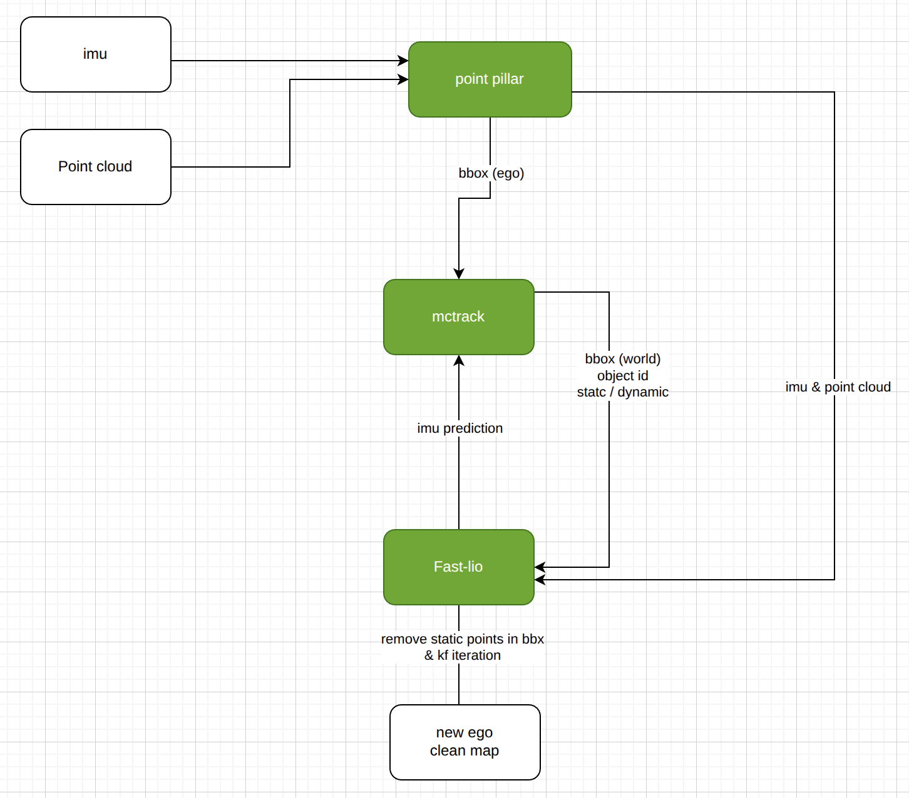
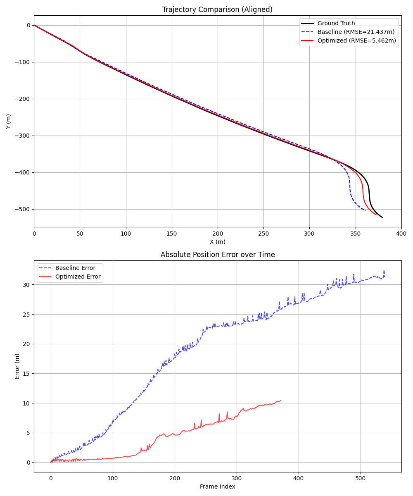

# ME5400: Advanced Robotics and Autonomous Systems

[](https://opensource.org/licenses/MIT)
[](http://wiki.ros.org/noetic)
[](https://www.python.org/)

这是ME5400高级机器人与自主系统课程项目，聚焦于**FAST-LIO 里程计与 MCTrack 多目标跟踪的融合管线**，用于自动驾驶场景下将实时点云/IMU 位姿与三维目标检测数据统一处理并可视化。

## 目录

- [🤖 面向协助代理的提示](#-面向协助代理的提示)
- [📋 项目概述与功能](#-项目概述与功能)
- [📁 项目结构](#-项目结构)
- [🛠️ 环境与安装](#️-环境与安装)
- [📊 数据准备](#-数据准备)
- [🎯 使用指南](#-使用指南)
- [📊 实验结果](#-实验结果)
- [🚀 会议论文创新点强化建议](#-会议论文创新点强化建议)
- [🔧 配置说明](#-配置说明)

## 🤖 面向协助代理的提示

- 请始终使用中文与项目成员沟通。
- 修改任意代码或脚本后，务必同步更新 `README.md`，保持流程说明与实现一致。
- 在修改完代码，请尝试运行，确保运行顺利再交付

## 📋 项目概述与功能

本项目实现了一个**基于激光雷达的 SLAM 与 多目标跟踪（MOT）双向融合闭环系统**。项目核心旨在探索里程计与跟踪任务的互补特性：利用 FAST-LIO 的高频精准位姿增强 MCTrack 的跟踪稳定性，同时利用 MCTrack 的动态目标感知反哺 FAST-LIO 以消除动态鬼影，提升建图精度。

### 🔄 双向协同管线

1. **里程计增强跟踪 (FAST-LIO ➡️ MCTrack)**

   * **高频位姿驱动**：FAST-LIO 提供的 IMU 预测位姿（高于 LiDAR 帧率）被用于 MCTrack 的运动补偿，显著提升了在载体剧烈运动或转弯时的跟踪鲁棒性。
   * **位姿引导的速度先验**：新增基于相邻帧全局坐标的检测级速度/加速度估计（支持匹配半径与EMA平滑配置），用于初始化 `global_velocity/global_acceleration`，减少“全零速度”导致的冷启动抖动。
   * **实时性保障**：通过使用预测位姿而非优化后位姿，降低了跟踪链路的端到端延迟。
2. **动态感知增强建图 (MCTrack ➡️ FAST-LIO)**

   * **动态路标剔除**：MCTrack 实时反馈动态目标（如行驶车辆、行人）的 3D 包围盒、速度与加速度信息。
   * **自适应降权**：FAST-LIO 前端接收反馈后，对落在动态区域的点云进行实时降权或剔除。这有效防止了动态物体被错误地融入静态地图，从而生成更清晰、无鬼影的全局点云地图。



### 📁 项目结构

```
ME5400/
├── catkin_ws/                         # ROS 工作空间
│   ├── src/fast_lio/                  # FAST-LIO2 源码（含定制化配置、输出目录等）
│   │   ├── config/                    # 传感器与映射参数（如 velodyne.yaml）
│   │   ├── launch/                    # ROS 启动文件
│   │   └── src/                       # FAST-LIO 核心实现
│   ├── src/ME5400/                    # MCTrack 联动 ROS 节点（在线跟踪、Marker、桥接脚本）
│   └── src/ME5400/msg/                # 自定义 Detection3D/Detection3DArray 消息
├── MCTrack/                           # 多目标跟踪框架（配置、评估与跟踪算法）
├── MMDET3D/                           # PointPillars 算法库（配置、权重、数据）
├── Scripts/                           # 🔥 融合管线统一启动脚本（按算法分类）
│   ├── pointpillars/                  # PointPillars 检测模块
│   │   ├── kitti_pointpillars_bag_node.py  # PointPillars 检测 ROS 节点
│   │   └── run_pointpillars_node.sh        # 启动脚本（自动化）
│   ├── fastlio/                       # FAST-LIO 里程计模块
│   │   └── run_fastlio.sh                  # FAST-LIO 统一启动脚本（支持 mapping/pose_bridge/both 模式）
│   ├── mctrack/                       # MCTrack 跟踪模块
│   │   ├── run_mctrack_online_node.sh      # MCTrack 启动脚本
│   │   └── mctrack_marker_publisher.py     # Marker 发布工具
│   ├── rviz/                          # RViz 可视化模块
│   │   ├── run_rviz.sh                     # 加载项目 RViz 配置
│   │   ├── rviz_headless_check.py          # 无头模式检查
│   │   └── ME5400.rviz                     # RViz 配置文件
│   └── utils/                         # 通用工具脚本
│       ├── kitti_tracking_to_rosbag.py     # KITTI 数据转 rosbag
│       ├── play_kitti_rosbag.sh            # rosbag 播放辅助
│       ├── build_catkin_ws.sh              # 工作空间编译脚本
│       └── ...                             # 其他工具脚本
├── Data_Tracking/                     # KITTI Tracking 数据与示例 rosbag
├── PCD/                               # FAST-LIO 自动导出的全局点云
└── README.md
```

**📌 架构说明**：

- **Scripts/**：按算法模块分类管理启动脚本（pointpillars/fastlio/mctrack/rviz/utils），清晰易维护
- **MMDET3D/**：仅保留 PointPillars 算法相关的配置、权重和数据
- **MCTrack/**：纯跟踪算法框架
- **catkin_ws/**：ROS 工作空间，包含 FAST-LIO 和 MCTrack 的 ROS 适配层

## 📊 实验结果

在 KITTI Tracking 序列 0020 上，评估结果显示 MCTrack 的动态物体剔除机制带来了显著的精度提升：

| 指标                        | 基准 (Baseline)   | 优化后 (Optimized) | 提升幅度         |
| :-------------------------- | :---------------- | :----------------- | :--------------- |
| **RMSE (均方根误差)** | **24.26 m** | **8.03 m**   | **66.90%** |
| 平均误差                    | 21.47 m           | 6.26 m             | 70.84%           |
| 最大误差                    | 36.59 m           | 15.83 m            | 56.73%           |

> **结论**: MCTrack 通过剔除动态物体特征点，有效抑制了“鬼影”和轨迹漂移，使定位精度提升了 **66.90%**。

### 可视化分析

下图展示了三条轨迹的对比（真值、基准、优化后）以及随时间变化的位姿误差：



* **上图 (轨迹对比)**:
  * **黑色实线**: KITTI 真值 (Ground Truth)
  * **蓝色虚线**: 基准轨迹 (Baseline)。可以看到在动态物体干扰下发生了严重漂移。
  * **红色实线**: 优化轨迹 (Optimized)。紧密跟随真值，鲁棒性更强。
* **下图 (误差曲线)**:
  * **蓝色曲线**: 基准误差，随时间迅速累积。
  * **红色曲线**: 优化误差，保持在较低水平。

## 🚀 会议论文创新点强化建议

如果希望将本项目进一步打磨为会议论文，建议将“系统实现”升级为“可验证的方法创新”，重点强化以下方向：

1. **双向闭环从工程集成升级为可学习策略**
   - 当前：基于规则的动态点降权（按目标速度/加速度阈值）。
   - 可强化创新：设计一个轻量权重生成网络（或不确定性估计模块），输入跟踪状态与点云局部统计，输出点级/框级动态权重，实现**自适应抑制动态干扰**。
   - 论文价值：从“规则融合”提升到“学习型闭环融合”。

2. **提出“时序错位鲁棒性”建模并量化**
   - 当前：FAST-LIO 高频位姿用于 MCTrack 补偿，已体现实时优势。
   - 可强化创新：显式构造“检测延迟 + 位姿先验误差”联合模型，提出延迟补偿项（如一阶外推+置信度门控），并报告不同延迟设置下的跟踪与定位退化曲线。
   - 论文价值：形成可复现实验协议，突出系统在真实在线部署中的稳定性贡献。

3. **从单场景效果升级为跨场景泛化结论**
   - 当前：主要结果集中在 KITTI 序列 0020。
   - 可强化创新：扩展到多个动态密度场景（高速/城市场景）并按目标速度分桶评估，给出“何种动态强度下收益最大”的规律。
   - 论文价值：从“case study”提升到“普适性结论”。

4. **增加与代表性基线的消融矩阵**
   - 建议至少包含：  
     - 仅 FAST-LIO  
     - FAST-LIO + 静态阈值剔除  
     - FAST-LIO + MCTrack 单向（仅前向补偿）  
     - **FAST-LIO + MCTrack 双向闭环（本方法）**
   - 配合 RMSE、ATE、HOTA/MOTA（若可）联合指标，明确每个模块的独立贡献。
   - 论文价值：增强“创新点不可替代性”的证据链。

> 结合当前结果（RMSE 已提升 66.90%），优先建议先完成 **“双向闭环 + 时序错位鲁棒性 + 消融矩阵”** 三件事。这一组合最容易形成清晰的会议论文主线：  
> **面向动态场景的在线 SLAM-MOT 闭环协同框架（方法） + 延迟鲁棒机制（理论/建模） + 跨场景消融验证（实验）**。

## 🛠️ 环境与安装

### 环境要求

#### 系统要求

- Ubuntu 20.04 LTS
- ROS Noetic
- Python 3.8+

#### 依赖库

```bash
# ROS依赖
sudo apt install ros-noetic-pcl-ros ros-noetic-eigen-conversions

# Python依赖
pip install numpy opencv-python matplotlib
```

#### PointPillars 快速环境配置（ME5400）

- **数据集路径**：`MMDET3D/data/kitti/`（rosbag 示例位于 `MMDET3D/data/kitti/seq_0019_with_det.bag`）
- **Conda 环境**：`ME5400`，Python 3.10.x
- **关键依赖版本**：CUDA Toolkit 12.8（含 NVCC）、PyTorch 2.10.0.dev+cu128（nightly）、MMCV 2.1.0（CUDA 12.8 源码编译版）、MMEngine 0.10.7、MMDetection 3.2.0、MMDetection3D 1.4.0
- **创建与激活环境**

  ```bash
  conda create -n ME5400 python=3.10
  conda activate ME5400
  ```
- **安装 CUDA 12.8（需管理员或本地 Toolkit）**

  1. 安装 NVIDIA 550+ 驱动并下载 [CUDA Toolkit 12.8](https://developer.nvidia.com/cuda-12-8-0-download-archive)。
  2. 仅选择 `cuda-toolkit` 组件（驱动已安装可跳过），安装路径建议 `/usr/local/cuda-12.8`。
  3. 在 `~/.bashrc` 增加：

     ```bash
     export CUDA_HOME=/usr/local/cuda-12.8
     export PATH=$CUDA_HOME/bin:$PATH
     export LD_LIBRARY_PATH=$CUDA_HOME/lib64:$LD_LIBRARY_PATH
     ```

     重新 `source ~/.bashrc`。
- **安装 PyTorch Nightly（CUDA 12.8）**

  ```bash
  pip install --upgrade pip
  pip install --pre torch torchvision torchaudio --index-url https://download.pytorch.org/whl/nightly/cu128
  ```
- **安装 OpenMMLab 组件（CUDA 12.8 编译）**

  ```bash
  pip install openmim
  mim install mmengine==0.10.7
  # 需要 NVCC，确保 CUDA_HOME 指向 Toolkit 12.8
  export CUDA_HOME=${CUDA_HOME:-/usr/local/cuda-12.8}
  MMCV_WITH_OPS=1 FORCE_CUDA=1 MAX_JOBS=4 mim install mmcv==2.1.0
  pip install mmdet==3.2.0 mmdet3d==1.4.0
  ```

  > 构建 `mmcv` 时会自动编译 CUDA/C++ 算子，耗时 5~10 分钟，请耐心等待；若内存较小可追加 `MAX_JOBS=4`。
  > 注意：目前 `mmdet3d==1.4.0` 对 `mmcv` 的版本上限为 `< 2.2.0`，请勿安装更高版本。
  >
- **常用依赖**

  ```bash
  pip install open3d==0.19.0 opencv-python==4.12.0.88 numpy==2.1.2 matplotlib==3.10.6 scipy==1.15.3 \
              scikit-learn==1.7.2 pandas==2.3.3 pillow==11.3.0 pyyaml==6.0.3 tqdm terminaltables==3.1.10 \
              shapely==1.8.5.post1 pyquaternion==0.9.9 trimesh==4.8.3 plyfile==1.1.2 imageio==2.37.0 \
              fire==0.7.1 tensorboard==2.20.0 protobuf==6.32.1
  pip install rospkg==1.6.0 catkin-pkg==1.1.0
  ```
- **安装验证**

  ```bash
  python -c "import torch; print('PyTorch版本:', torch.__version__); print('CUDA可用:', torch.cuda.is_available()); print('编译支持架构:', torch.cuda.get_arch_list())"
  python -c "import mmcv; print('MMCV版本:', mmcv.__version__)"
  python -c "import mmdet3d; print('MMDetection3D版本:', mmdet3d.__version__)"
  ```

### 安装步骤

#### 1. 克隆仓库

```bash
git clone https://github.com/XC-CN/ME5400.git
cd ME5400
```

#### 2. 编译FAST-LIO2

```bash
cd catkin_ws
source /opt/ros/noetic/setup.bash
catkin_make
source devel/setup.bash
```

#### 3. 安装MCTrack依赖

```bash
cd MCTrack
pip install -r requirements.txt
```

### 📊 数据准备

本项目依赖 [KITTI Tracking Benchmark](http://www.cvlibs.net/datasets/kitti/eval_tracking.php) 数据集。请按照以下步骤下载并组织数据。

### 1. 数据集下载

请访问 [KITTI Tracking Benchmark 官网](http://www.cvlibs.net/datasets/kitti/eval_tracking.php) 下载以下文件：

- **Velodyne point clouds (29 GB)**: `data_tracking_velodyne.zip`
- **Training labels of object data (5 MB)**: `data_tracking_label_2.zip`
- **Camera calibration matrices of object data (1 MB)**: `data_tracking_calib.zip`
- **GPS/IMU data (Overlay of GPS/IMU data on the raw data)**: `data_tracking_oxts.zip`

### 2. 目录结构组织

下载完成后，请解压并将文件放置在 `Data_Tracking` 目录下，结构如下：

```plain
ME5400/
└── Data_Tracking/
    └── training/
        ├── calib/              # data_tracking_calib.zip 解压内容
        ├── label_02/           # data_tracking_label_2.zip 解压内容
        ├── oxts/               # data_tracking_oxts.zip 解压内容
        └── velodyne/           # data_tracking_velodyne.zip 解压内容
```

> **注意**：
>
> * `MMDET3D/data/kitti` 目录是为 MMDetection3D 准备的，通常通过软链接指向 `Data_Tracking` 或单独配置。
> * 本项目提供的脚本默认假设数据位于 `Data_Tracking` 下。

## 🎯 使用指南

> 当前检测由 MMDetection3D PointPillars 推理节点发布至 `/detection/bboxes_3d` 与 `/detection/kitti_tracking`；新增 `/detection/lidar_detections`（`Detection3DArray`，带原始点云时间戳），后续如需替换，可接入其他检测器但需保持话题接口一致。

运行前请准备好 KITTI Tracking 数据目录（用于工况播放与 MCTrack 标定信息）：

- `Data_Tracking/training/`：需包含 `calib/`、`oxts/`、`velodyne/` 等子目录。
- `tracking/det_tracking_lsvm/`：仅在评估历史检测时使用；实时检测场景可忽略。
- 将点云+IMU 数据转换为 rosbag 并放在 `tracking/rosbags/`，或者直接使用仓库提供的示例 bag。

> 当前流程仍通过播放 KITTI Tracking 序列的 rosbag 来驱动，暂未直接接入实时传感器。

可使用提供的工具脚本从 KITTI Tracking 原始数据生成所需 rosbag（默认只需点云与 IMU）：

```bash
./Scripts/utils/kitti_tracking_to_rosbag.py --seq 20 --include_detections False
```

也可以直接使用 `MMDET3D/data/kitti/seq_0019_with_det.bag` 或 `tracking/rosbags/seq_0019_with_det.bag` 作为示例数据。

### 🚀 **一键启动（推荐）**

如果您已准备好环境和数据，可以直接运行以下脚本启动全流程（自动跳过数据生成步骤）：

```bash
# 默认运行：仅执行优化测试 (FAST-LIO + MCTrack)
# 示例：运行序列 0020 (默认)
./Scripts/run_all.sh
# 示例：运行序列 0019
./Scripts/run_all.sh 0019

# 基准运行：仅运行基准测试 (无优化)
./Scripts/run_all.sh --baseline [SEQ_ID]
```

该脚本将自动执行以下操作：

1. 启动 `roscore`
2. 执行 `build_catkin_ws.sh` 确保工作空间已编译（若已编译则跳过）
3. 启动 `RViz` 可视化
4. 启动 `PointPillars` 检测节点
5. **(默认模式)** 运行优化后的 `FAST-LIO` (带 MCTrack) 并保存地图/轨迹 (`scans_optimized.pcd`)
6. **(基准模式)** 运行基准 `FAST-LIO` (无优化) 并保存地图/轨迹 (`scans_baseline.pcd`)
7. 生成评估报告 (仅在默认模式下且存在基准结果时)

---

### **分步启动指南**

以下是手动分步启动的详细流程：

### 1. **启动 roscore（终端 A）**

```bash
roscore
```

### 2. **【首次运行或代码更新后】编译工作空间**

```bash
./Scripts/utils/build_catkin_ws.sh
```

### 3. **【可选】生成或更新默认 rosbag**

```bash
./Scripts/utils/kitti_tracking_to_rosbag.py --seq 20  #制作第20号场景的rosbag
```

### 4. **启动 PointPillars 检测节点（终端 B）**

```bash
./Scripts/pointpillars/run_pointpillars_node.sh
```

### 5. **启动 FAST-LIO 系统（终端 C）**

FAST-LIO 提供三种启动方式：

```bash
# 启用动态权重优化（默认）
./Scripts/fastlio/run_fastlio.sh both

# 禁用动态权重优化，使用原始方法
./Scripts/fastlio/run_fastlio.sh both use_dynamic_weights:=false
```

> **使用说明**：
>
> - `both` 模式会同时启动 mapping 和 pose_bridge（mapping 在后台运行）
> - 动态权重优化功能默认启用，可通过 `use_dynamic_weights` 参数控制
> - FAST-LIO 会发布 `/Odometry_imu_predicted` 话题（IMU 预测位姿，LiDAR 更新前），用于提高 MCTrack 的实时性

### 6. **启动 MCTrack 在线节点（终端 D）**

```bash
./Scripts/mctrack/run_mctrack_online_node.sh
```

### 7. **播放 rosbag（终端 F，保持运行）**

```bash
rosparam set use_sim_time true
   
# 高速公路场景
rosbag play Data_Tracking/rosbags/seq_0020_nodet.bag --clock 
   
# 城市街道行人密集场景
rosbag play Data_Tracking/rosbags/seq_0019_nodet.bag --clock
```

--loop为循环运行

结束运行时，必须先关闭fastlio建图进程，再关闭rosbag。

### 8. **打开 RViz（终端 E，与 rosbag 同时运行）**

```bash
./Scripts/rviz/run_rviz.sh
```

   使用 `Scripts/rviz/ME5400.rviz` 配置实时查看点云、PointPillars 检测与 MCTrack 结果。

### 🔧 配置说明

### FAST-LIO2 配置

主要配置文件：`catkin_ws/src/fast_lio/config/velodyne.yaml`

```yaml
common:
  lid_topic: "/detection/pointcloud"   # PointPillars 转发的激光雷达话题
  imu_topic: "/detection/imu"          # PointPillars 转发的 IMU 话题

preprocess:
  lidar_type: 2                        # Velodyne激光雷达
  scan_line: 64                        # 扫描线数
  scan_rate: 10                        # 扫描频率

mapping:
  extrinsic_T: [0, 0, 0.28]           # 外参平移
  extrinsic_R: [1, 0, 0,              # 外参旋转
                0, 1, 0,
                0, 0, 1]
```

#### FAST-LIO 动态目标降权

**功能说明**：

- FAST-LIO 支持对动态目标进行降权处理，减少运动车辆对建图的影响
- 在 `mapping_velodyne.launch` 中通过 `use_dynamic_weights` 参数控制是否启用（默认 `true`）
- 节点会自动订阅 `/mctrack/tracked_objects`，并根据 `velocity_fusion`、`acceleration` 与检测置信度为每个跟踪目标计算权重

**工作原理**：

- **权重注入**：LiDAR 点云在预处理阶段会检查每个点是否落在动态目标包围盒内。若在框内，计算出的动态权重（基于速度/加速度/置信度）将与原始 `intensity` 取最小值写入 `intensity` 字段（确保高强度点被降权，低强度点保持原样）。
- **优化降权**：FAST-LIO 在后端优化线性化时，读取该 `intensity` 作为权重缩放雅可比矩阵与残差，从而减弱高速/高置信度车辆对建图的影响。
- **时序闭环**：
  - **时刻 T**：FastLIO 基于 IMU 预积分和当前点云计算出位姿 $P_t$。此时它使用的是上一帧（T-1）传回的动态权重（基于连续性假设）。
  - **时刻 T**：McTrack 接收 $P_t$ 和点云，进行检测和跟踪，输出动态物体列表 $O_t$。
  - **时刻 T+1**：FastLIO 接收到 $O_t$，利用它来计算下一帧点云的权重。

**使用方法**：

```bash
# 启用动态权重优化（默认）
./Scripts/fastlio/run_fastlio.sh both use_dynamic_weights:=true

# 禁用动态权重优化，使用原始方法
./Scripts/fastlio/run_fastlio.sh both use_dynamic_weights:=false
```

**参数配置**：

- 相关参数（惩罚系数、速度/加速度阈值、bbox 裁剪边界、超时阈值等）均以 `preprocess/dynamic_*` 形式提供
- 详见 `catkin_ws/src/fast_lio/launch/mapping_velodyne.launch`，可按需要在启动命令中覆盖

#### FAST-LIO 地图保存

**保存位置**：

- 地图文件保存在项目根目录的 `PCD/scans.pcd`
- 默认配置下，所有扫描帧会累积保存到一个 PCD 文件中

**保存时机**：

- 地图在 FAST-LIO 进程正常退出时自动保存
- 使用 `both` 模式时，脚本会优雅关闭进程（发送 SIGTERM），等待最多 30 秒让进程保存地图
- 如果进程在 30 秒内未退出，脚本会强制终止（SIGKILL）

**保存进度信息**：

- FAST-LIO 在保存地图时会显示详细的进度信息：
  - 点云数量（点数）
  - 预计文件大小（MB）
  - 保存路径
  - 实际文件大小和保存耗时
  - 保存成功/失败状态

**保存验证**：

- 脚本会自动验证地图文件是否保存成功：
  - 检查文件是否存在
  - 验证文件大小（确保不为0）
  - 显示文件大小（MB）
  - 如果保存失败，会显示错误信息

**正确中断建图**：

```bash
# 方法一：使用 Ctrl+C（推荐）
# 脚本会自动处理优雅关闭，等待地图保存，并验证保存结果

# 方法二：单独启动 mapping 时，使用 Ctrl+C
# FAST-LIO 会捕获信号并正常退出，显示保存进度，地图会被保存
```

**注意事项**：

- 确保 `velodyne.yaml` 中 `pcd_save/pcd_save_en: true`（默认已启用）
- 如果地图文件很大，保存可能需要几秒钟到几十秒时间
- 脚本会等待最多 30 秒确保地图保存完成
- 如果进程被强制杀死（kill -9），地图可能不会保存
- 地图保存位置可通过 `pcd_save/output_dir` 参数自定义
- 如果点云数据为空，地图文件不会生成（这是正常行为）
