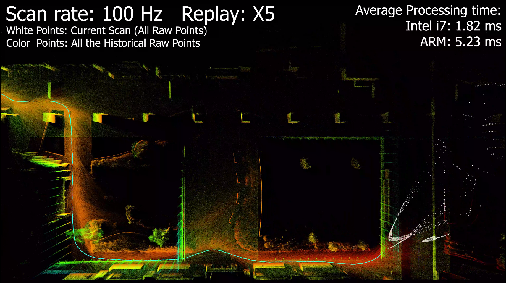
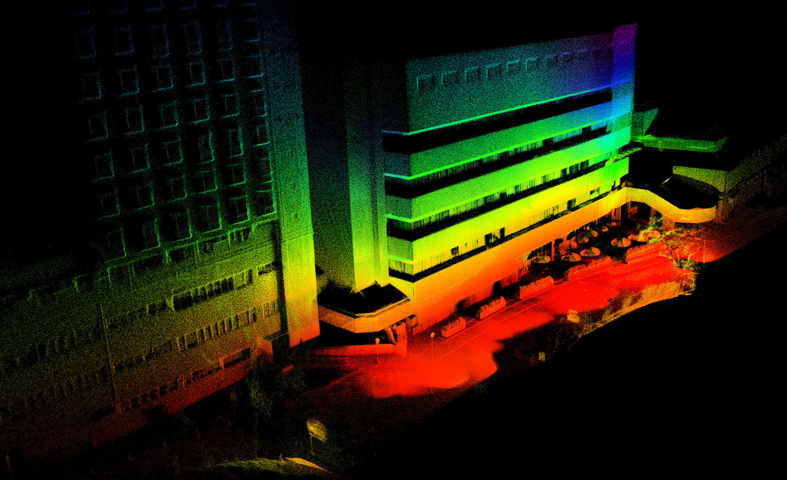
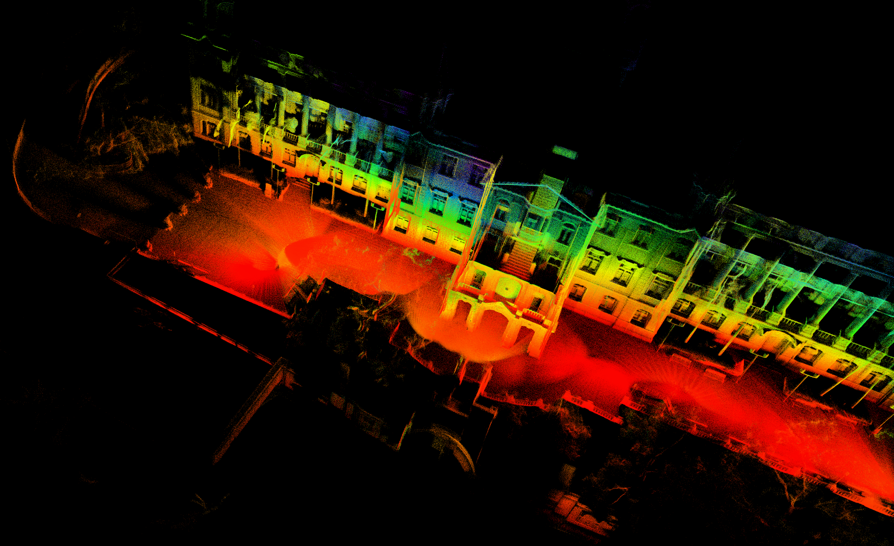
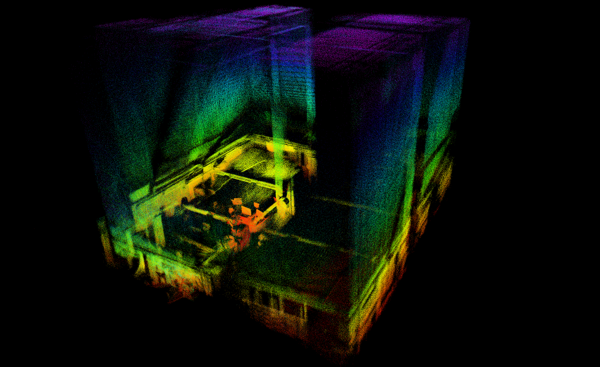

## 相关工作与扩展应用

**SLAM:**

1. [ikd-Tree](https://github.com/hku-mars/ikd-Tree): 用于3D kNN搜索的最先进动态KD树。
2. [R2LIVE](https://github.com/hku-mars/r2live): 使用FAST-LIO作为激光雷达-惯性前端的高精度激光雷达-惯性-视觉融合工作。
3. [LI_Init](https://github.com/hku-mars/LiDAR_IMU_Init): 一个鲁棒的实时激光雷达-IMU外参初始化和同步包。
4. [FAST-LIO-LOCALIZATION](https://github.com/HViktorTsoi/FAST_LIO_LOCALIZATION): 集成FAST-LIO和**重定位**功能模块。
5. [FAST-LIVO](https://github.com/hku-mars/FAST-LIVO) | [FAST-LIVO2](https://github.com/hku-mars/FAST-LIVO2): 具有高计算效率、鲁棒性和像素级精度的最先进激光雷达-惯性-视觉里程计（LIVO）系统。

**控制与规划:**

1. [IKFOM](https://github.com/hku-mars/IKFoM): 快速高精度流形卡尔曼滤波工具箱。
2. [UAV Avoiding Dynamic Obstacles](https://github.com/hku-mars/dyn_small_obs_avoidance): FAST-LIO在机器人规划中的实现之一。
3. [UGV Demo](https://www.youtube.com/watch?v=wikgrQbE6Cs): 可微流形上的轨迹跟踪模型预测控制。
4. [Bubble Planner](https://arxiv.org/abs/2202.12177): 使用后退走廊规划高速平滑四旋翼轨迹。

<!-- 10. [**FAST-LIVO**](https://github.com/hku-mars/FAST-LIVO): Fast and Tightly-coupled Sparse-Direct LiDAR-Inertial-Visual Odometry. -->

## FAST-LIO

**FAST-LIO** (快速激光雷达-惯性里程计) 是一个计算高效且鲁棒的激光雷达-惯性里程计包。它使用紧密耦合的迭代扩展卡尔曼滤波器融合激光雷达特征点与IMU数据，以在快速运动、噪声或杂乱环境中实现鲁棒导航，即使在退化情况下也能正常工作。我们的包解决了许多关键问题：

1. 用于里程计优化的快速迭代卡尔曼滤波器；
2. 在大多数稳定环境中自动初始化；
3. 并行KD树搜索以减少计算量；

## FAST-LIO 2.0 (2021-07-05 更新)

<!--  -->

<!-- [](https://youtu.be/2OvjGnxszf8) -->

<div align="left">


</div>

**相关视频:**  [FAST-LIO2](https://youtu.be/2OvjGnxszf8),  [FAST-LIO1](https://youtu.be/iYCY6T79oNU)

**流程:**

<div align="center">

</div>

**新特性:**

1. 使用 [ikd-Tree](https://github.com/hku-mars/ikd-Tree) 进行增量建图，实现更快的速度和超过100Hz的激光雷达频率。
2. 在原始激光雷达点云上直接进行里程计计算（扫描到地图）（可以禁用特征提取），获得更好的精度。
3. 由于不需要特征提取，FAST-LIO2可以支持多种类型的激光雷达，包括旋转式（Velodyne、Ouster）和固态（Livox Avia、Horizon、MID-70）激光雷达，并且可以轻松扩展以支持更多激光雷达。
4. 支持外部IMU。
5. 支持基于ARM的平台，包括Khadas VIM3、Nvidia TX2、Raspberry Pi 4B(8G RAM)。

**相关论文**:

[FAST-LIO2: 快速直接激光雷达-惯性里程计](doc/Fast_LIO_2.pdf)

[FAST-LIO: 基于紧密耦合迭代卡尔曼滤波的快速鲁棒激光雷达-惯性里程计包](https://arxiv.org/abs/2010.08196)

**贡献者**

[Wei Xu 徐威](https://github.com/XW-HKU)，[Yixi Cai 蔡逸熙](https://github.com/Ecstasy-EC)，[Dongjiao He 贺东娇](https://github.com/Joanna-HE)，[Fangcheng Zhu 朱方程](https://github.com/zfc-zfc)，[Jiarong Lin 林家荣](https://github.com/ziv-lin)，[Zheng Liu 刘政](https://github.com/Zale-Liu), [Borong Yuan](https://github.com/borongyuan)

<!-- <div align="center">
    
    
</div> -->

## 1. 先决条件

### 1.1 **Ubuntu** 和 **ROS**

**Ubuntu >= 16.04**

对于 **Ubuntu 18.04 或更高版本**，**默认**的PCL和Eigen足以让FAST-LIO正常工作。

ROS    >= Melodic. [ROS安装](http://wiki.ros.org/ROS/Installation)

### 1.2. **PCL && Eigen**

PCL    >= 1.8,   请参考 [PCL安装](http://www.pointclouds.org/downloads/linux.html).

Eigen  >= 3.3.4, 请参考 [Eigen安装](http://eigen.tuxfamily.org/index.php?title=Main_Page).

### 1.3. **livox_ros_driver**

请参考 [livox_ros_driver安装](https://github.com/Livox-SDK/livox_ros_driver).

*备注:*

- 由于FAST-LIO必须首先支持Livox系列激光雷达，因此在运行任何FAST-LIO启动文件之前，必须安装并**source** **livox_ros_driver**。
- 如何source？最简单的方法是将行 ``source $Livox_ros_driver_dir$/devel/setup.bash`` 添加到文件 ``~/.bashrc`` 的末尾，其中 ``$Livox_ros_driver_dir$`` 是livox ros驱动工作空间的目录（如果您完全按照livox官方文档操作，应该是 ``ws_livox`` 目录）。

## 2. 编译

如果您想使用docker容器运行fastlio2，请在您的机器上安装docker。
请参考 [Docker安装](https://docs.docker.com/engine/install/ubuntu/)。

### 2.1 Docker容器

用户可以通过以下命令在linux中创建一个任意名称的新脚本：

```
touch <your_custom_name>.sh
```

将以下代码放置在 ``<your_custom_name>.sh`` 脚本中。

```
#!/bin/bash
mkdir docker_ws
# 在Docker中运行支持GUI的ROS Kinetic的脚本

# 允许从本地机器访问X服务器
xhost +local:

# 容器名称
CONTAINER_NAME="fastlio2"

# 运行Docker容器
docker run -itd \
  --name=$CONTAINER_NAME \
  --user mars_ugv \
  --network host \
  --ipc=host \
  -v /home/$USER/docker_ws:/home/mars_ugv/docker_ws \
  --privileged \
  --env="QT_X11_NO_MITSHM=1" \
  --volume="/etc/localtime:/etc/localtime:ro" \
  -v /dev/bus/usb:/dev/bus/usb \
  --device=/dev/dri \
  --group-add video \
  -v /tmp/.X11-unix:/tmp/.X11-unix \
  --env="DISPLAY=$DISPLAY" \
  kenny0407/marslab_fastlio2:latest \
  /bin/bash
```

执行以下命令以授予脚本执行权限，使其可运行：

```
sudo chmod +x <your_custom_name>.sh
```

执行以下命令以下载镜像并创建容器。

```
./<your_custom_name>.sh
```

*脚本说明:*

- 下面提供的docker run命令使用Docker Hub中的镜像创建一个带标签的容器。此镜像的下载时间可能因用户的网络速度而异。
- 此命令还建立一个名为 ``docker_ws`` 的新工作空间，它作为Docker容器和主机之间的共享文件夹。这意味着如果用户希望运行rosbag示例，他们需要下载rosbag文件并将其放在主机上的 ``docker_ws`` 目录中。
- 随后，Docker容器内同名文件夹将接收此文件。然后用户可以在Docker内轻松播放文件。
- 在此示例中，我们已将主机的网络与Docker容器共享。因此，如果用户执行 ``rostopic list`` 命令，无论是在主机上还是在Docker容器内运行，他们都会观察到相同的输出。"

### 2.2 从源码编译

克隆仓库并进行catkin_make：

```
    cd ~/$A_ROS_DIR$/src
    git clone https://github.com/hku-mars/FAST_LIO.git
    cd FAST_LIO
    git submodule update --init
    cd ../..
    catkin_make
    source devel/setup.bash
```

- 记住在编译前source livox_ros_driver（参考1.3 **livox_ros_driver**）
- 如果您想使用自定义构建的PCL，请将以下行添加到~/.bashrc
  ``export PCL_ROOT={CUSTOM_PCL_PATH}``

## 3. 直接运行

注意：

A. 请确保IMU和激光雷达**同步**，这很重要。

B. 警告消息"Failed to find match for field 'time'."意味着rosbag文件中缺少每个激光雷达点的时间戳。这对前向传播和后向传播很重要。

C. 如果给出了外参，我们建议将**extrinsic_est_en**设置为false。关于外参初始化，请参考我们最近的工作：[**鲁棒实时激光雷达-惯性初始化**](https://github.com/hku-mars/LiDAR_IMU_Init)。

### 3.1 对于Avia

按照 [Livox-ros-driver安装](https://github.com/Livox-SDK/livox_ros_driver) 将您的PC连接到Livox Avia激光雷达，然后

```
    cd ~/$FAST_LIO_ROS_DIR$
    source devel/setup.bash
    roslaunch fast_lio mapping_avia.launch
    roslaunch livox_ros_driver livox_lidar_msg.launch
```

- 对于livox系列，FAST-LIO仅支持由 ``livox_lidar_msg.launch`` 收集的数据，因为只有其 ``livox_ros_driver/CustomMsg`` 数据结构产生每个激光雷达点的时间戳，这对运动去畸变非常重要。 ``livox_lidar.launch`` 目前无法产生它。
- 如果您想更改帧率，请在编译livox_ros_driver包之前修改 [Livox-ros-driver](https://github.com/Livox-SDK/livox_ros_driver) 的 [livox_lidar_msg.launch](https://github.com/Livox-SDK/livox_ros_driver/blob/master/livox_ros_driver/launch/livox_lidar_msg.launch) 中的**publish_freq**参数。

### 3.2 对于带外部IMU的Livox系列

mapping_avia.launch理论上支持mid-70、mid-40或其他livox系列激光雷达，但需要在运行前设置一些参数：

编辑 ``config/avia.yaml`` 以设置以下参数：

1. 激光雷达点云话题名称：``lid_topic``
2. IMU话题名称：``imu_topic``
3. 平移外参：``extrinsic_T``
4. 旋转外参：``extrinsic_R``（仅支持旋转矩阵）

- FAST-LIO中的外参定义为激光雷达在IMU机体坐标系中的姿态（位置和旋转矩阵）（即IMU是基坐标系）。它们可以在官方手册中找到。
- FAST-LIO为livox激光雷达产生一个非常简单的软件时间同步，设置参数 ``time_sync_en`` 为true来开启。但只有在外部时间同步真的不可能时才开启，因为软件时间同步无法保证精度。

### 3.3 对于Velodyne或Ouster（以Velodyne为例）

步骤A：运行前设置

编辑 ``config/velodyne.yaml`` 以设置以下参数：

1. 激光雷达点云话题名称：``lid_topic``
2. IMU话题名称：``imu_topic``（内部和外部都可以，6轴或9轴都可以）
3. 根据PoindCloud2 rostopic中**time**（Velodyne）或**t**（Ouster）字段的单位设置参数 ``timestamp_unit``
4. 线数（我们测试了16、32和64线，但没有测试128线或以上）：``scan_line``
5. 平移外参：``extrinsic_T``
6. 旋转外参：``extrinsic_R``（仅支持旋转矩阵）

- FAST-LIO中的外参定义为激光雷达在IMU机体坐标系中的姿态（位置和旋转矩阵）（即IMU是基坐标系）。

步骤B：运行以下命令

```
    cd ~/$FAST_LIO_ROS_DIR$
    source devel/setup.bash
    roslaunch fast_lio mapping_velodyne.launch
```

步骤C：运行激光雷达的ros驱动或播放rosbag。

### 3.4 对于MARSIM模拟器

安装MARSIM：https://github.com/hku-mars/MARSIM 并按以下方式运行MARSIM

```
cd ~/$MARSIM_ROS_DIR$
roslaunch test_interface single_drone_avia.launch
```

然后运行FAST-LIO：

```
roslaunch fast_lio mapping_marsim.launch
```

### 3.5 PCD文件保存

在启动文件中将 ``pcd_save_enable`` 设置为 ``1``。所有扫描（在全局坐标系中）将在FAST-LIO终止后累积并保存到文件 ``FAST_LIO/PCD/scans.pcd``。``pcl_viewer scans.pcd`` 可以可视化点云。

*pcl_viewer使用技巧：*

- 在pcl_viewer运行时按键盘1,2,3,4,5来改变可视化/着色内容。

```
    1 是全部随机
    2 是X值
    3 是Y值
    4 是Z值
    5 是强度
```

## 4. Rosbag示例

### 4.1 Livox Avia Rosbag

<div align="left">



文件：可从 [google drive](https://drive.google.com/drive/folders/1CGYEJ9-wWjr8INyan6q1BZz_5VtGB-fP?usp=sharing) 下载

运行：

```
roslaunch fast_lio mapping_avia.launch
rosbag play YOUR_DOWNLOADED.bag

```

### 4.2 Velodyne HDL-32E Rosbag

**NCLT数据集**：原始bin文件可以在 [这里](http://robots.engin.umich.edu/nclt/) 找到。

我们制作了 [Rosbag文件](https://drive.google.com/drive/folders/1blQJuAB4S80NwZmpM6oALyHWvBljPSOE?usp=sharing) 和 [一个python脚本](https://drive.google.com/file/d/1QC9IRBv2_-cgo_AEvL62E1ml1IL9ht6J/view?usp=sharing) 来生成Rosbag文件：``python3 sensordata_to_rosbag_fastlio.py bin_file_dir bag_name.bag``

运行：

```
roslaunch fast_lio mapping_velodyne.launch
rosbag play YOUR_DOWNLOADED.bag
```
