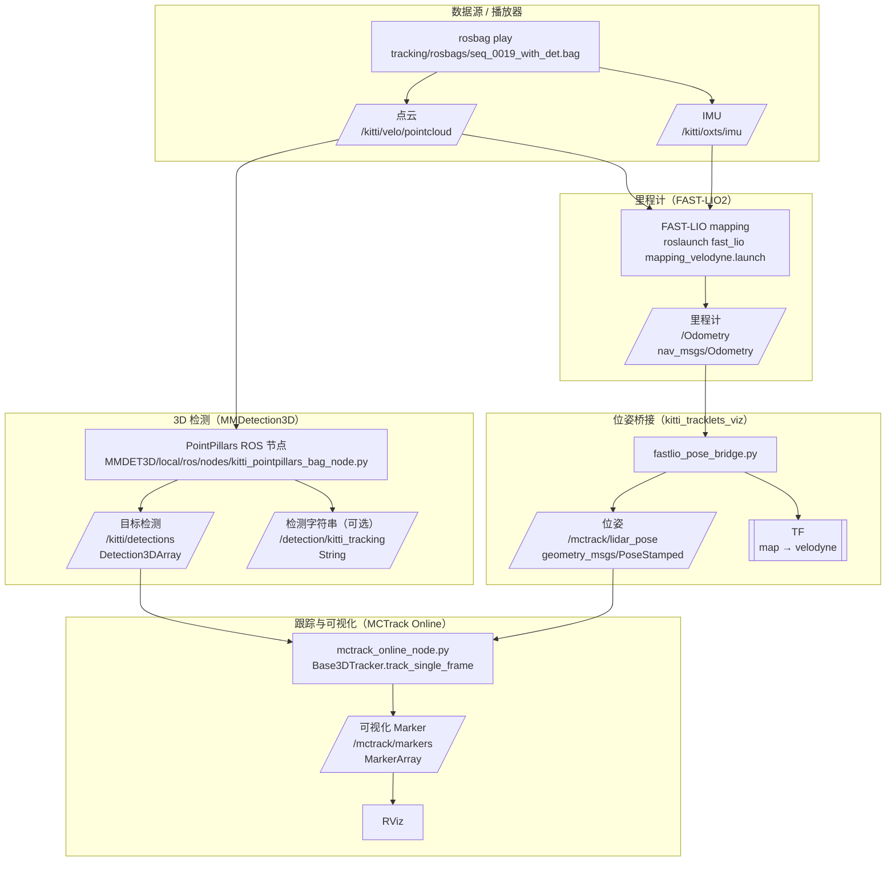

# 在线 ROS 联动融合管线（FAST-LIO × PointPillars × MCTrack）

> 目的：将 **点云/IMU 里程计（FAST-LIO）** 与 **3D 检测（PointPillars）** 对齐，驱动 **MCTrack 在线跟踪** 并在 RViz 中可视化输出。

## 启动脚本对照（与仓库脚本一致）

- PointPillars：
  - 直接启动：`python MMDET3D/local/ros/nodes/kitti_pointpillars_bag_node.py`
  - 一键（可选）：`MMDET3D/local/ros/scripts/run_bag_node.sh`
- FAST-LIO：`Scripts/run_fastlio_mapping.sh`
- Pose Bridge：`Scripts/run_fastlio_pose_bridge.sh`
- MCTrack Online：`Scripts/run_mctrack_online_node.sh`
- RViz：`Scripts/run_rviz.sh`

## 备注（避免接口误解）

- `mctrack_online_node.py` 默认订阅 **`/kitti/detections`（Detection3DArray）**。
- `PointPillars` 同时也会发布 **`/detection/kitti_tracking`（String）**，但该在线节点默认不消费该话题。

