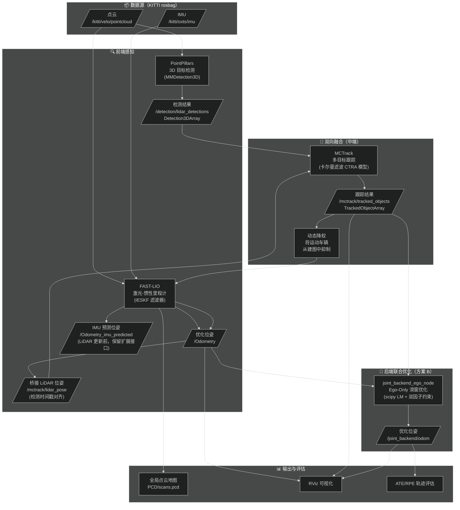
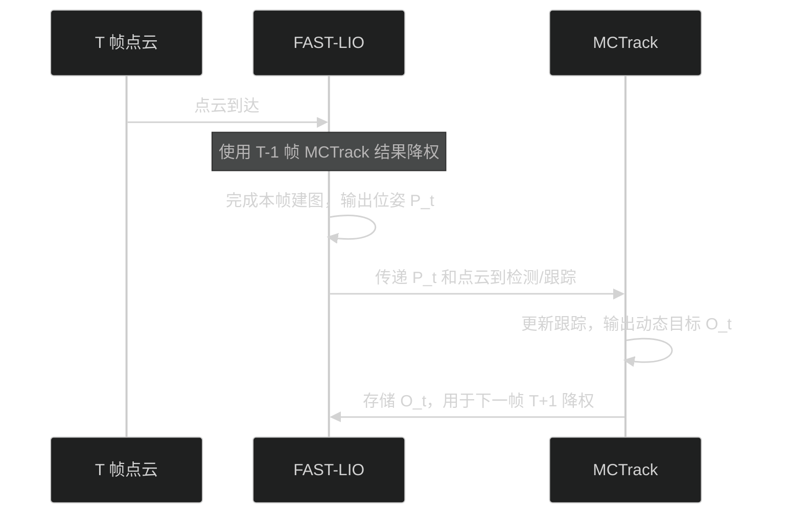
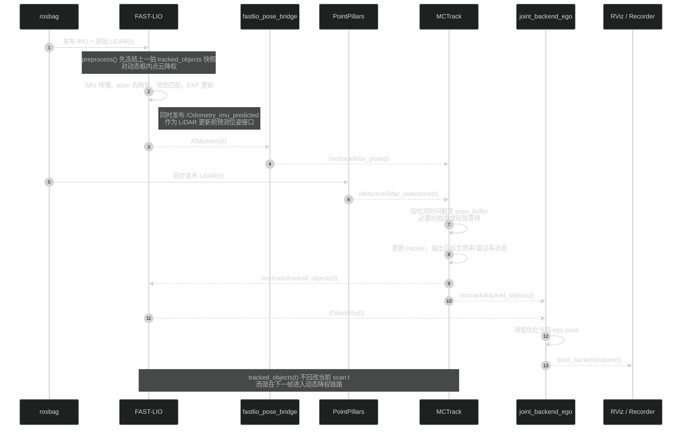
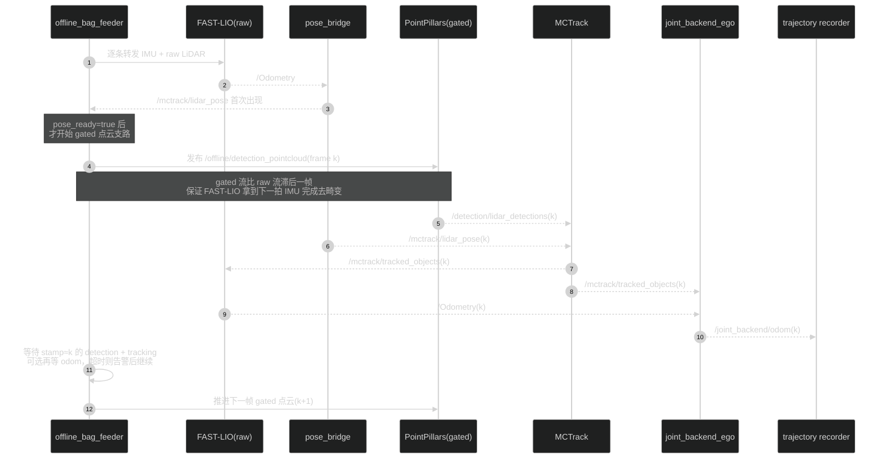
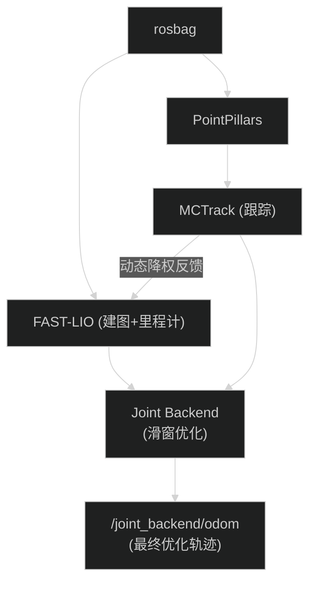

### 🔄 项目思路及实现原理

本项目围绕一个核心问题展开：**自动驾驶场景中，路上运动的车辆会干扰激光雷达建图和定位，如何让 SLAM 与目标跟踪互相帮助、共同提升精度？**

整个系统分为三层：**前端感知**、**双向融合**、**后端联合优化**。下图展示了完整数据流：



---

#### 第一层：前端感知 — 「看见世界」

| 模块                   | 作用                                                                  | 关键输出                        |
| ---------------------- | --------------------------------------------------------------------- | ------------------------------- |
| **PointPillars** | 将每帧点云转化为「哪里有什么车」的 3D 检测框                          | `/detection/lidar_detections` |
| **FAST-LIO**     | 融合激光雷达 + IMU，以 IESKF 迭代误差状态卡尔曼滤波器计算自车实时位姿 | `/Odometry`                   |

> 💡 **通俗理解**：PointPillars 是「眼睛」，负责看清前方有哪些车；FAST-LIO 是「内耳」，负责感知自身在哪里、朝哪走。

---

#### 第二层：双向融合 — 「互相帮忙」

这是本项目的核心创新，两个模块形成**闭环反馈**：

**① FAST-LIO ➡️ MCTrack（里程计帮助跟踪）**

- FAST-LIO 会持续输出稳定的自车位姿 `/Odometry`，并额外对外发布 LiDAR 更新前的 `/Odometry_imu_predicted`
- 当前仓库实现中，`fastlio_pose_bridge` 会将 `/Odometry` 转成 `/mctrack/lidar_pose`，MCTrack 再按检测时间戳对位姿做插值/对齐
- 效果：跟踪更稳定，不容易在快速转弯时丢失目标；同时保留 `/Odometry_imu_predicted` 作为高频预测位姿接口，便于后续扩展

**② MCTrack ➡️ FAST-LIO（跟踪帮助建图）**

- MCTrack 输出每辆被跟踪车辆的**3D 包围盒 + 速度 + 置信度**
- FAST-LIO 收到后，对落在这些动态框内的激光点进行**自适应降权**：
  - 车速越快 → 权重越低（几乎忽略）
  - 置信度越高 → 降权越激进
- 效果：动态车辆不再被「误当成路边建筑物」写入地图，消除**动态鬼影**，地图更干净

> 💡 **通俗理解**：FAST-LIO 告诉 MCTrack「我在这里，帮你算目标在哪」；MCTrack 反过来告诉 FAST-LIO「那几个点是动的车，建图时别信它们」。两者形成了一个互利闭环。

**时序逻辑**分成两层来看：先看概念闭环，再看当前仓库代码里的实现级详细时序。

**概念闭环（单帧视角）**：



**实现级详细时序 A：在线优化链路（`Scripts/run_optimized.sh`）**



**实现级详细时序 B：离线半同步双轨（`Scripts/run_offline_all.sh` 中 `JointOffline`）**



> **实现要点**：
>
> - 在线链路是**异步闭环**：当前帧跟踪结果主要作用于下一帧 FAST-LIO 的动态点降权
> - 离线链路是**半同步闭环**：`offline_bag_feeder` 按 LiDAR 帧推进，并按时间戳等待检测/跟踪完成后再放行下一帧
> - `gated` 检测支路默认比 `raw` 点云慢一拍，这是为了给 FAST-LIO 保留足够的 IMU lookahead 完成当前 scan 去畸变

---

#### 第三层：后端联合优化 — 「事后再精修」（方案 B）

前两层已经产生了质量不错的里程计。但动态目标除了「干扰建图」，还能**反过来帮助修正自车定位**——这就是**方案 B（Ego-Only 滑窗优化）**的核心思路。

**核心思想**

> 一辆被稳定跟踪的车，它在世界坐标系中的位置是可以预测的。
> 如果自车当前的位姿估计有偏差，那么「自车看到这辆车的相对位置」就会与预测不符。
> 反过来，我们可以**利用这个差异来纠正自车的位姿**。

**数学框架（通俗版）**

优化器以一个**滑动窗口**（默认 10 帧 ≈ 1 秒）为单位，同时调整窗口内所有帧的自车位姿，使得两类残差同时最小：

| 约束名                             | 含义                                                      | 权重来源                          |
| ---------------------------------- | --------------------------------------------------------- | --------------------------------- |
| **里程计一致性** `r_odom`  | 相邻帧间的「相对运动」应与 FAST-LIO 结果吻合              | FAST-LIO 协方差（越确信权重越大） |
| **目标观测一致性** `r_obj` | 自车当前位姿估计下「看到目标的位置」应与 MCTrack 观测匹配 | 检测置信度 × 轨迹稳定性 × λ    |

目标位姿由 MCTrack 速度传播预测，**不参与优化变量**（目标只是「锚点」，自车才是被优化的对象）。

**可靠性门控**（只有高质量目标才能参与约束）

```
track_length ≥ 3 帧        → 避免新出现的不稳定目标
detection_score ≥ 0.5      → 过滤低置信度检测
速度突变 Δv < 3 m/s        → 排除急刹车/碰撞等异常运动
时间戳差 < 0.2 s           → 确保时间同步
```

**输出**：优化后的自车里程计 `/joint_backend/odom`，可与 FAST-LIO 原始结果做 ATE/RPE 对比评估。

> 💡 **通俗理解**：就像你开车时，除了看路牌（里程计），还能通过「前方那辆车的相对位置有没有变化」来判断自己走歪了没有。方案 B 就是让被跟踪的车辆充当「移动参照物」，帮助修正自车轨迹。

---

#### 整体数据流汇总

